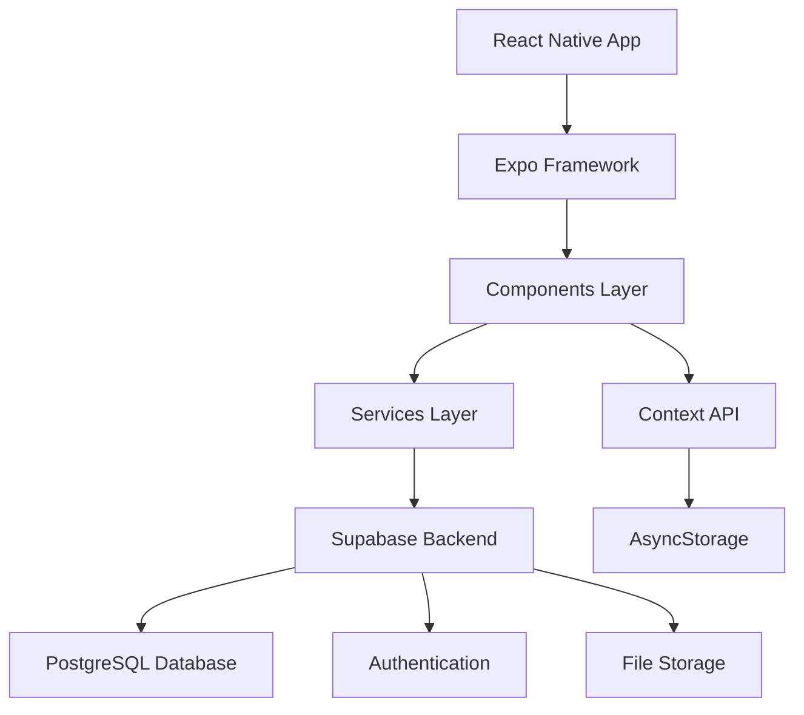

<div align="center">
  
  
  <h1 style="color: #2E7D32; margin-top: 20px;">🐾 PetCare Pro</h1>
  
  <p><strong>Sistema Completo para Gestão de Clínicas Veterinárias e Petshops</strong></p>
  
  <p>
    
    
    
    
  </p>
  
  <p>
    
    
    
  </p>
</div>

---

## 📋 Índice

- [🎯 Sobre o Projeto](#-sobre-o-projeto)
- [🚀 Características](#-características)
- [🛠️ Tecnologias](#️-tecnologias)
- [📱 Compatibilidade](#-compatibilidade)
- [🏗️ Arquitetura](#️-arquitetura)
- [📁 Estrutura do Projeto](#-estrutura-do-projeto)
- [⚡ Instalação e Configuração](#-instalação-e-configuração)
- [🎮 Como Usar](#-como-usar)
- [📊 Funcionalidades Principais](#-funcionalidades-principais)
- [🎨 Design System](#-design-system)
- [📘 Scripts Disponíveis](#-scripts-disponíveis)
- [🔧 Configuração do Ambiente](#-configuração-do-ambiente)
- [🗄️ Banco de Dados](#️-banco-de-dados)
- [📈 Roadmap](#-roadmap)
- [🤝 Contribuição](#-contribuição)
- [📄 Licença](#-licença)
- [👥 Equipe](#-equipe)
- [📞 Suporte](#-suporte)

---

## 🎯 Sobre o Projeto

O **PetCare Pro** é um sistema completo e moderno desenvolvido especificamente para veterinários brasileiros que desejam digitalizar e otimizar a gestão de suas clínicas veterinárias e petshops. 

### 🌟 Por que PetCare Pro?

Em um mercado veterinário em constante crescimento no Brasil, com mais de 149 milhões de animais de estimação (segundo o Instituto Pet Brasil), a digitalização dos processos se tornou essencial para:

- **Eficiência Operacional**: Reduzir tempo gasto em tarefas administrativas
- **Melhor Atendimento**: Acesso rápido ao histórico completo dos pacientes
- **Gestão Financeira**: Controle de receitas e procedimentos realizados
- **Organização**: Sistema centralizado para clientes, pets e consultas
- **Mobilidade**: Acesso às informações em qualquer lugar

### 🎯 Objetivo Principal

Fornecer uma solução **gratuita**, **intuitiva** e **completa** que permita aos veterinários focar no que fazem de melhor: **cuidar dos animais**.

---

## 🚀 Características

### ✅ Funcionalidades Implementadas

| Módulo | Funcionalidade | Status |
|--------|----------------|--------|
| 🔐 **Autenticação** | Sistema completo de login/registro | ✅ Completo |
| 📊 **Dashboard** | Estatísticas em tempo real | ✅ Completo |
| 👥 **Gestão de Clientes** | CRUD completo com validações | ✅ Completo |
| 🐾 **Gestão de Pets** | Cadastro detalhado e histórico | ✅ Completo |
| 📋 **Consultas** | Registro completo de atendimentos | ✅ Completo |
| 📅 **Agenda** | Sistema de agendamentos | ✅ Completo |
| 📚 **Biblioteca Veterinária** | Medicamentos, vacinas e procedimentos | ✅ Completo |
| 📱 **Interface Responsiva** | Design moderno e intuitivo | ✅ Completo |
| 💾 **Armazenamento** | Banco de dados robusto (Supabase) | ✅ Completo |
| ✅ **Validação** | Formulários com validação completa | ✅ Completo |
| 🔄 **Estados** | Loading, erro e sucesso | ✅ Completo |

### 🚧 Em Desenvolvimento

| Funcionalidade | Previsão | Prioridade |
|----------------|----------|------------|
| 📧 **Notificações Push** | v1.1.0 | Alta |
| 📊 **Relatórios PDF** | v1.2.0 | Alta |
| ☁️ **Backup em Nuvem** | v1.2.0 | Média |
| 🔄 **Sincronização Multi-device** | v1.3.0 | Média |
| 📱 **App para Clientes** | v2.0.0 | Baixa |
| 🏥 **Multi-clínica** | v2.0.0 | Baixa |

---

## 🛠️ Tecnologias

### 🎯 Core Technologies

| Tecnologia | Versão | Propósito |
|------------|--------|-----------|
| **React Native** | 0.79.2 | Framework principal para desenvolvimento móvel |
| **Expo SDK** | 53.0.9 | Plataforma de desenvolvimento e build |
| **Supabase** | 2.39.0 | Backend-as-a-Service (BaaS) |
| **React Navigation** | v6 | Navegação entre telas |
| **AsyncStorage** | 2.1.2 | Armazenamento local |

### 🎨 UI/UX Libraries

| Biblioteca | Versão | Funcionalidade |
|------------|--------|----------------|
| **Expo Vector Icons** | 14.1.0 | Ícones vetorizados |
| **React Native Gesture Handler** | 2.24.0 | Gestos e interações |
| **React Native Reanimated** | 3.17.4 | Animações fluidas |
| **Expo Linear Gradient** | 14.1.4 | Gradientes visuais |
| **React Native Safe Area Context** | 5.4.0 | Área segura para dispositivos |

### 🔧 Development Tools

| Ferramenta | Versão | Propósito |
|------------|--------|-----------|
| **Babel Core** | 7.20.0 | Transpilação JavaScript |
| **React Native Picker** | 2.11.0 | Seletores dropdown |
| **Expo Image Picker** | 15.0.7 | Seleção de imagens |
| **Expo Splash Screen** | 0.29.9 | Tela de carregamento |

### 🗄️ Database & Backend

| Serviço | Funcionalidade |
|---------|----------------|
| **Supabase PostgreSQL** | Banco de dados principal |
| **Supabase Auth** | Autenticação de usuários |
| **Supabase Storage** | Armazenamento de arquivos |
| **Supabase Realtime** | Sincronização em tempo real |

---

## 📱 Compatibilidade

### 📋 Requisitos de Sistema

| Plataforma | Versão Mínima | Status |
|------------|---------------|--------|
| **iOS** | 12.0+ | ✅ Totalmente suportado |
| **Android** | API 21+ (Android 5.0) | ✅ Totalmente suportado |
| **Expo Go** | Última versão | ✅ Desenvolvimento e testes |
| **Expo Development Build** | - | ✅ Builds customizados |

### 🎯 Dispositivos Testados

- **iOS**: iPhone 12+, iPad Air 4+
- **Android**: Samsung Galaxy S21+, Pixel 6+
- **Tablets**: Suporte responsivo completo

---

## 🏗️ Arquitetura

### 📐 Padrões Arquiteturais



### 🔄 Fluxo de Dados

1. **UI Components** → Interação do usuário
2. **Context API** → Gerenciamento de estado global
3. **Services** → Lógica de negócio e API calls
4. **Supabase** → Backend e persistência
5. **AsyncStorage** → Cache local

---

## 📁 Estrutura do Projeto

```
📦 PetCare Pro
├── 📱 App.js                     # Componente raiz da aplicação
├── 📝 app.json                   # Configurações do Expo
├── 📦 package.json               # Dependências e scripts
├── 🛠️ babel.config.js            # Configuração do Babel
├── 🚫 .gitignore                 # Arquivos ignorados pelo Git
├── 📖 README.md                  # Documentação do projeto
├── 🖼️ assets/                    # Recursos estáticos
│   └── 🎨 logo.png              # Logo da aplicação
├── 🗄️ db/                        # Scripts de banco de dados
│   └── 📊 supabase.sql          # Schema e dados iniciais
└── 📂 src/                       # Código fonte principal
    ├── 🧩 components/            # Componentes reutilizáveis
    │   ├── 🔄 common/           # Componentes genéricos
    │   │   ├── 🔘 Button.js     # Botão customizado
    │   │   ├── 📇 Card.js       # Container de conteúdo
    │   │   ├── 📝 Input.js      # Campo de entrada
    │   │   └── ⏳ Loading.js    # Indicador de carregamento
    │   └── 📋 forms/            # Componentes de formulário
    ├── 📱 screens/              # Telas da aplicação
    │   ├── 🔐 auth/             # Autenticação
    │   │   └── 🚪 LoginScreen.js
    │   ├── 👥 clients/          # Gestão de clientes
    │   │   ├── 📋 ClientListScreen.js
    │   │   └── ➕ NewClientScreen.js
    │   ├── 🐾 pets/             # Gestão de pets
    │   │   ├── 📋 PetListScreen.js
    │   │   └── ➕ NewPetScreen.js
    │   ├── 🩺 consultations/    # Consultas veterinárias
    │   │   └── ➕ NewConsultationScreen.js
    │   ├── 📅 agenda/           # Sistema de agendamentos
    │   │   ├── 📅 AgendaScreen.js
    │   │   └── ➕ NewAppointmentScreen.js
    │   ├── 📚 library/          # Biblioteca veterinária
    │   │   └── 📖 VetLibraryScreen.js
    │   ├── 👤 profile/          # Perfil do usuário
    │   │   └── 👤 ProfileScreen.js
    │   └── 🏠 HomeScreen.js     # Dashboard principal
    ├── 🌐 services/             # Serviços de dados
    │   ├── 👥 ClientService.js
    │   ├── 🐾 PetService.js
    │   ├── 🩺 ConsultationService.js
    │   ├── 📅 AppointmentService.js
    │   └── 📚 LibraryService.js
    ├── 🔄 contexts/             # Contextos React
    │   └── 🔐 AuthContext.js
    ├── 📱 navigation/           # Configuração de navegação
    │   ├── 🧭 AppNavigator.js
    │   ├── 🔐 AuthNavigator.js
    │   └── 🏠 MainNavigator.js
    ├── 🎨 constants/            # Constantes da aplicação
    │   ├── 🎨 Colors.js
    │   ├── 📊 Data.js
    │   └── 💾 Storage.js
    ├── 🔧 utils/                # Utilitários
    │   ├── 🛠️ helpers.js
    │   ├── 💾 storage.js
    │   └── ✅ validators.js
    ├── 🎨 styles/               # Estilos globais
    │   └── 🌐 globalStyles.js
    └── ⚙️ config/               # Configurações
        └── 🔧 supabase.js
```

---

## ⚡ Instalação e Configuração

### 📋 Pré-requisitos

Certifique-se de ter instalado:

- **Node.js** (versão 18.0.0 ou superior)
- **npm** ou **yarn**
- **Expo CLI** (recomendado: versão mais recente)
- **Git**

```bash
# Verificar versões
node --version    # v18.0.0+
npm --version     # 8.0.0+
expo --version    # 49.0.0+
```

### 🚀 Instalação Rápida

#### Opção 1: Clone do Repositório

```bash
# 1. Clone o repositório
git clone https://github.com/PetCareAi/consultorio-app.git

# 2. Entre no diretório
cd consultorio-app

# 3. Instale as dependências
npm install
# ou
yarn install

# 4. Configure o banco de dados (ver seção Database)

# 5. Inicie o projeto
npm start
# ou
expo start
```

#### Opção 2: Criação do Zero

```bash
# 1. Criar projeto Expo
npx create-expo-app PetCarePro --template blank

# 2. Entrar no diretório
cd PetCarePro

# 3. Instalar dependências principais
npm install @react-navigation/native @react-navigation/stack @react-navigation/bottom-tabs

# 4. Instalar dependências do React Navigation
npm install react-native-screens react-native-safe-area-context

# 5. Instalar outras dependências
npm install @react-native-async-storage/async-storage @expo/vector-icons @react-native-picker/picker react-native-gesture-handler react-native-reanimated @supabase/supabase-js expo-image-picker expo-splash-screen expo-linear-gradient react-native-url-polyfill

# 6. Configurar projeto (copiar arquivos src/, db/, etc.)
```

### ⚙️ Configuração do Supabase

1. **Criar conta no Supabase**: [https://supabase.com](https://supabase.com)

2. **Criar novo projeto**:
   - Nome: `PetCare Pro`
   - Região: `South America (São Paulo)`
   - Senha do banco: (escolha uma senha forte)

3. **Executar script do banco**:
   ```sql
   -- Execute o conteúdo do arquivo db/supabase.sql
   -- no SQL Editor do Supabase
   ```

4. **Configurar credenciais**:
   ```javascript
   // src/config/supabase.js
   const supabaseUrl = 'SUA_URL_DO_SUPABASE'
   const supabaseAnonKey = 'SUA_CHAVE_PUBLICA'
   ```

### 📱 Executar o Projeto

```bash
# Modo desenvolvimento
npm start

# Executar no iOS Simulator
npm run ios

# Executar no Android Emulator  
npm run android

# Executar na web
npm run web
```

---

## 🎮 Como Usar

### 🔐 Primeiro Acesso

1. **Abra o aplicativo**
2. **Use as credenciais de demonstração**:
   - 📧 **Email**: `admin@petcare.com`
   - 🔒 **Senha**: `123456`
3. **Ou crie uma nova conta** clicando em "Cadastrar"

### 🏠 Dashboard Principal

O dashboard oferece uma visão geral completa:

- **📊 Estatísticas em tempo real**
- **📅 Agenda do dia**
- **⚡ Ações rápidas**
- **📈 Métricas importantes**

### 👥 Gestão de Clientes

#### ➕ Adicionar Cliente
1. Navegue para **Clientes** → **Novo**
2. Preencha os dados obrigatórios:
   - Nome completo
   - Email
   - Telefone
3. Dados opcionais:
   - CPF, endereço, observações

#### 🔍 Buscar Clientes
- Use a barra de busca
- Pesquise por: nome, email, telefone, CPF

### 🐾 Gestão de Pets

#### ➕ Cadastrar Pet
1. **Clientes** → Selecionar cliente → **Novo Pet**
2. Informações básicas:
   - Nome do pet
   - Espécie (Cão, Gato, etc.)
   - Raça
   - Sexo
3. Detalhes físicos:
   - Data de nascimento
   - Peso
   - Cor
   - Microchip

### 🩺 Registro de Consultas

#### ➕ Nova Consulta
1. **Pets** → Selecionar pet → **Nova Consulta**
2. Informações da consulta:
   - Tipo de consulta
   - Sintomas
   - Diagnóstico
   - Tratamento
   - Prescrição
3. Sinais vitais:
   - Peso, temperatura, frequência cardíaca
4. Valor da consulta

### 📅 Sistema de Agendamentos

#### ➕ Novo Agendamento
1. **Agenda** → **Novo Agendamento**
2. Selecionar:
   - Cliente e pet
   - Data e hora
   - Duração
   - Tipo de procedimento

### 📚 Biblioteca Veterinária

A biblioteca contém:

#### 💊 Medicamentos
- Dosagem recomendada
- Frequência de administração
- Contraindicações
- Observações importantes

#### 💉 Vacinas
- Protocolo de vacinação
- Doenças prevenidas
- Cronograma de reforços
- Espécies aplicáveis

#### ⚕️ Procedimentos
- Duração estimada
- Preço sugerido
- Descrição detalhada

---

## 📊 Funcionalidades Principais

### 🔐 Sistema de Autenticação

```javascript
// Exemplo de uso
const { login, register, logout, user } = useAuth();

// Login
const result = await login('email@exemplo.com', 'senha123');

// Verificar se está autenticado
if (user) {
  // Usuário logado
}
```

### 📊 Dashboard Interativo

- **Estatísticas em tempo real**
- **Gráficos e métricas**
- **Agenda do dia**
- **Ações rápidas**
- **Lembretes importantes**

### 👥 Gestão Completa de Clientes

```javascript
// Exemplo de operações CRUD
import { ClientService } from '../services/ClientService';

// Listar clientes
const clients = await ClientService.getAll();

// Criar cliente
const result = await ClientService.create(clientData);

// Buscar cliente
const clients = await ClientService.search('João');
```

### 🐾 Controle de Pets

- **Cadastro detalhado**
- **Histórico médico completo**
- **Cálculo automático de idade**
- **Upload de fotos**
- **Microchip tracking**

### 🩺 Consultas Veterinárias

```javascript
// Registro de consulta
const consultationData = {
  clientId: 'uuid',
  petId: 'uuid', 
  type: 'Consulta de Rotina',
  symptoms: 'Descrição dos sintomas',
  diagnosis: 'Diagnóstico',
  treatment: 'Tratamento realizado',
  prescription: 'Medicamentos prescritos',
  price: 80.00
};
```

### 📅 Sistema de Agendamentos

- **Calendário interativo**
- **Visualização por dia/semana/mês**
- **Status dos agendamentos**
- **Notificações automáticas**
- **Reagendamentos**

---

## 🎨 Design System

### 🎨 Paleta de Cores

```javascript
// Cores principais
const Colors = {
  primary: '#2E7D32',        // Verde veterinário principal
  primaryDark: '#1B5E20',    // Verde escuro
  primaryLight: '#4CAF50',   // Verde claro
  secondary: '#81C784',      // Verde secundário
  accent: '#66BB6A',         // Verde destaque
  
  // Cores de superfície
  background: '#F1F8E9',     // Fundo principal
  surface: '#FFFFFF',        // Superfícies de cartões
  
  // Cores de status
  error: '#F44336',          // Erro/perigo
  warning: '#FF9800',        // Aviso
  info: '#2196F3',          // Informação
  success: '#4CAF50',       // Sucesso
  
  // Cores de texto
  text: '#212121',          // Texto principal
  textSecondary: '#757575', // Texto secundário
  border: '#E0E0E0',        // Bordas
};
```

### 🧩 Componentes

#### Button Component
```javascript
<Button 
  title="Salvar"
  variant="primary"        // primary, secondary, outline, danger
  size="medium"           // small, medium, large
  loading={false}
  onPress={handleSave}
  icon={<Ionicons name="save" />}
/>
```

#### Input Component
```javascript
<Input 
  label="Nome"
  placeholder="Digite o nome"
  leftIcon="person"
  error="Campo obrigatório"
  required
  multiline={false}
/>
```

#### Card Component
```javascript
<Card style={customStyle}>
  <Text>Conteúdo do cartão</Text>
</Card>
```

### 📱 Responsividade

O design se adapta automaticamente a diferentes tamanhos de tela:

- **Smartphones**: 320px - 480px
- **Tablets**: 768px - 1024px
- **Layout flexível**: Componentes se reorganizam automaticamente

---

## 📘 Scripts Disponíveis

### 🚀 Scripts de Desenvolvimento

```bash
# Iniciar servidor de desenvolvimento
npm start

# Executar no iOS Simulator
npm run ios

# Executar no Android Emulator
npm run android

# Executar na web
npm run web

# Setup inicial do projeto
npm run setup

# Resetar cache e dependências
npm run reset

# Gerar build para produção
npm run prebuild
```

### 🏗️ Scripts de Build

```bash
# Build para Android
npm run build:android

# Build para iOS
npm run build:ios

# Build universal
eas build --platform all
```

### 🧪 Scripts de Teste

```bash
# Executar testes
npm test

# Executar testes com coverage
npm run test:coverage

# Executar linter
npm run lint

# Corrigir problemas de lint automaticamente
npm run lint:fix
```

### 📊 Scripts de Análise

```bash
# Analisar bundle size
npm run analyze

# Verificar dependências vulneráveis
npm audit

# Atualizar dependências
npm update
```

---

## 🔧 Configuração do Ambiente

### 📱 Desenvolvimento iOS

```bash
# Instalar Xcode (Mac App Store)
# Instalar iOS Simulator

# Configurar ambiente
npx @react-native-community/cli doctor

# Executar no simulador
npm run ios
```

### 🤖 Desenvolvimento Android

```bash
# Instalar Android Studio
# Configurar Android SDK

# Variáveis de ambiente (adicionar ao .bashrc/.zshrc)
export ANDROID_HOME=$HOME/Library/Android/sdk
export PATH=$PATH:$ANDROID_HOME/emulator
export PATH=$PATH:$ANDROID_HOME/tools
export PATH=$PATH:$ANDROID_HOME/platform-tools

# Executar no emulador
npm run android
```

### ☁️ Configuração do Supabase

#### 1. Configuração Inicial

```javascript
// src/config/supabase.js
import { createClient } from '@supabase/supabase-js';

const supabaseUrl = 'https://seu-projeto.supabase.co';
const supabaseAnonKey = 'sua-chave-publica';

export const supabase = createClient(supabaseUrl, supabaseAnonKey, {
  auth: {
    autoRefreshToken: true,
    persistSession: true,
    detectSessionInUrl: false,
  },
});
```

#### 2. Configuração de Políticas RLS

```sql
-- Habilitar RLS (Row Level Security)
ALTER TABLE users_consultorio ENABLE ROW LEVEL SECURITY;
ALTER TABLE clients_consultorio ENABLE ROW LEVEL SECURITY;
ALTER TABLE pets_consultorio ENABLE ROW LEVEL SECURITY;
ALTER TABLE consultations_consultorio ENABLE ROW LEVEL SECURITY;
ALTER TABLE appointments_consultorio ENABLE ROW LEVEL SECURITY;

-- Políticas de exemplo
CREATE POLICY "Users can view own data" ON clients_consultorio
  FOR SELECT USING (user_id = auth.uid());
```

---

## 🗄️ Banco de Dados

### 📊 Schema Principal

```sql
-- Usuários (Veterinários)
CREATE TABLE users_consultorio (
  id UUID PRIMARY KEY,
  email VARCHAR(255) UNIQUE NOT NULL,
  name VARCHAR(255) NOT NULL,
  profession VARCHAR(100) DEFAULT 'Veterinário(a)',
  clinic VARCHAR(255),
  crmv VARCHAR(50),
  phone VARCHAR(20),
  photo_url TEXT,
  created_at TIMESTAMP WITH TIME ZONE DEFAULT NOW(),
  updated_at TIMESTAMP WITH TIME ZONE DEFAULT NOW()
);

-- Clientes
CREATE TABLE clients_consultorio (
  id UUID DEFAULT gen_random_uuid() PRIMARY KEY,
  user_id UUID NOT NULL REFERENCES users_consultorio(id),
  name VARCHAR(255) NOT NULL,
  email VARCHAR(255) NOT NULL,
  phone VARCHAR(20) NOT NULL,
  cpf VARCHAR(14),
  address TEXT,
  city VARCHAR(100),
  state VARCHAR(2),
  zip_code VARCHAR(10),
  notes TEXT,
  created_at TIMESTAMP WITH TIME ZONE DEFAULT NOW(),
  updated_at TIMESTAMP WITH TIME ZONE DEFAULT NOW()
);

-- Pets
CREATE TABLE pets_consultorio (
  id UUID DEFAULT gen_random_uuid() PRIMARY KEY,
  client_id UUID NOT NULL REFERENCES clients_consultorio(id),
  name VARCHAR(255) NOT NULL,
  species VARCHAR(50) NOT NULL,
  breed VARCHAR(100),
  gender VARCHAR(10) NOT NULL,
  birth_date DATE,
  weight DECIMAL(5,2),
  color VARCHAR(100),
  microchip VARCHAR(50),
  photo_url TEXT,
  notes TEXT,
  created_at TIMESTAMP WITH TIME ZONE DEFAULT NOW(),
  updated_at TIMESTAMP WITH TIME ZONE DEFAULT NOW()
);

-- Consultas
CREATE TABLE consultations_consultorio (
  id UUID DEFAULT gen_random_uuid() PRIMARY KEY,
  client_id UUID NOT NULL REFERENCES clients_consultorio(id),
  pet_id UUID NOT NULL REFERENCES pets_consultorio(id),
  user_id UUID NOT NULL REFERENCES users_consultorio(id),
  type VARCHAR(100) NOT NULL,
  date TIMESTAMP WITH TIME ZONE NOT NULL,
  symptoms TEXT,
  diagnosis TEXT,
  treatment TEXT,
  prescription TEXT,
  observations TEXT,
  follow_up_date TIMESTAMP WITH TIME ZONE,
  weight DECIMAL(5,2),
  temperature DECIMAL(4,1),
  heart_rate INTEGER,
  price DECIMAL(10,2) DEFAULT 0,
  created_at TIMESTAMP WITH TIME ZONE DEFAULT NOW(),
  updated_at TIMESTAMP WITH TIME ZONE DEFAULT NOW()
);
```

### 🔍 Índices para Performance

```sql
-- Índices otimizados
CREATE INDEX clients_user_id_idx ON clients_consultorio(user_id);
CREATE INDEX clients_email_idx ON clients_consultorio(email);
CREATE INDEX pets_client_id_idx ON pets_consultorio(client_id);
CREATE INDEX consultations_user_id_idx ON consultations_consultorio(user_id);
CREATE INDEX consultations_date_idx ON consultations_consultorio(date);
```

### 📈 Métricas e Analytics

```sql
-- Queries úteis para relatórios
-- Total de consultas por mês
SELECT 
  DATE_TRUNC('month', date) as month,
  COUNT(*) as total_consultations,
  SUM(price) as total_revenue
FROM consultations_consultorio 
WHERE user_id = $1
GROUP BY month
ORDER BY month DESC;

-- Pets mais atendidos
SELECT 
  p.name,
  p.species,
  c.name as client_name,
  COUNT(*) as consultation_count
FROM consultations_consultorio co
JOIN pets_consultorio p ON p.id = co.pet_id
JOIN clients_consultorio c ON c.id = co.client_id
WHERE co.user_id = $1
GROUP BY p.id, p.name, p.species, c.name
ORDER BY consultation_count DESC
LIMIT 10;
```

---

## 📈 Roadmap

### 🎯 Versão 1.1.0 (Q2 2025)
- [ ] 📧 **Sistema de notificações push**
- [ ] 🔄 **Sincronização offline**
- [ ] 📊 **Relatórios básicos em PDF**
- [ ] 🔐 **Recuperação de senha**
- [ ] 👤 **Perfil detalhado do veterinário**

### 🎯 Versão 1.2.0 (Q3 2025)
- [ ] 📅 **Agendamento online para clientes**
- [ ] 🤖 **Lembretes automáticos (WhatsApp/SMS)**
- [ ] 📱 **App dedicado para clientes**
- [ ] 💳 **Integração com meios de pagamento**
- [ ] 📋 **Templates de prescrição**

### 🎯 Versão 1.3.0 (Q4 2025)
- [ ] 🏥 **Suporte multi-clínica**
- [ ] 👥 **Sistema de funcionários e permissões**
- [ ] 📊 **Dashboard avançado com gráficos**
- [ ] 🔄 **Integração com equipamentos médicos**
- [ ] 📷 **Reconhecimento de texto em receitas**

### 🎯 Versão 2.0.0 (Q1 2025)
- [ ] 🤖 **Inteligência Artificial para diagnósticos**
- [ ] 🌐 **API pública para integrações**
- [ ] 📱 **Versão web completa**
- [ ] 🌎 **Internacionalização (i18n)**
- [ ] ☁️ **Backup automático em múltiplas nuvens**

### 🔮 Futuro
- [ ] 🏆 **Sistema de gamificação**
- [ ] 📺 **Telemedicina veterinária**
- [ ] 🔗 **Blockchain para registros médicos**
- [ ] 🎯 **Machine Learning para previsões**

---

## 🤝 Contribuição

Contribuições são sempre bem-vindas! Este projeto é open source e desenvolvido para a comunidade veterinária brasileira.

### 🚀 Como Contribuir

#### 1. 🍴 Fork do Projeto
```bash
# Fork no GitHub e clone
git clone https://github.com/seu-usuario/petcare-pro.git
cd petcare-pro
```

#### 2. 🌿 Criar Branch
```bash
# Criar branch para feature
git checkout -b feature/nova-funcionalidade

# Criar branch para bugfix
git checkout -b bugfix/correcao-bug
```

#### 3. 💻 Desenvolvimento
```bash
# Instalar dependências
npm install

# Executar em modo desenvolvimento
npm start

# Executar testes
npm test
```

#### 4. ✅ Commit e Push
```bash
# Adicionar arquivos
git add .

# Commit com mensagem descritiva
git commit -m "feat: adiciona nova funcionalidade X"

# Push para o GitHub
git push origin feature/nova-funcionalidade
```

#### 5. 🔄 Pull Request
1. Abra um Pull Request no GitHub
2. Descreva as mudanças realizadas
3. Aguarde review da equipe
4. Realize ajustes se necessário

### 📝 Padrões de Commit

Seguimos o padrão [Conventional Commits](https://www.conventionalcommits.org/):

```bash
# Tipos de commit
feat:     # Nova funcionalidade
fix:      # Correção de bug
docs:     # Documentação
style:    # Formatação, sem mudança de código
refactor: # Refatoração de código
test:     # Adição ou correção de testes
chore:    # Manutenção geral

# Exemplos
git commit -m "feat: adiciona validação de CPF"
git commit -m "fix: corrige erro no login"
git commit -m "docs: atualiza README com novas instruções"
```

### 🐛 Reportar Bugs

Para reportar bugs, use o [GitHub Issues](https://github.com/PetCareAi/consultorio-app/issues):

**Template de Bug Report:**
```markdown
## 🐛 Descrição do Bug
Descrição clara do que está acontecendo.

## 🔄 Passos para Reproduzir
1. Vá para '...'
2. Clique em '...'
3. Veja o erro

## ✅ Comportamento Esperado
O que deveria acontecer.

## 📱 Ambiente
- Dispositivo: [ex: iPhone 12]
- OS: [ex: iOS 15.1]
- Versão do App: [ex: 1.0.0]
```

### 💡 Sugerir Funcionalidades

Para sugerir novas funcionalidades:

**Template de Feature Request:**
```markdown
## 🚀 Funcionalidade Solicitada
Descrição clara da funcionalidade.

## 🎯 Problema que Resolve
Qual problema esta funcionalidade resolveria?

## 💡 Solução Proposta
Descrição detalhada da solução.

## 🔄 Alternativas Consideradas
Outras abordagens que você considerou.
```

### 👥 Equipe de Desenvolvimento

- **Core Maintainers**: Responsáveis pela arquitetura e decisões técnicas
- **Community Contributors**: Desenvolvedores da comunidade
- **Veterinary Advisors**: Veterinários que fornecem feedback funcional

---

## 📄 Licença

Este projeto está sob **licença proprietária** da **PetCareAi Ltda**.

```
CONTRATO DE LICENCA DE SOFTWARE PROPRIETARIO
PETCAREAI - SISTEMA INTELIGENTE PARA CUIDADOS COM PETS

Versao: 1.0
Data de Vigencia: 1o de Junho de 2025
Copyright (c) 2025 PetCareAi Ltda. Todos os direitos reservados.

================================================================================

1. DEFINICOES

Para os fins deste Contrato, os seguintes termos terao os significados abaixo:

"Licenciante" significa PetCareAi Ltda., pessoa juridica de direito privado, 
inscrita no CNPJ sob no [INSERIR], com sede em [INSERIR ENDERECO].

"Licenciado" significa a pessoa fisica ou juridica que obteve acesso 
autorizado ao Software sob os termos deste Contrato.

"Software" significa o sistema PetCareAi, incluindo todo codigo fonte, codigo 
objeto, bibliotecas, modulos, documentacao tecnica, interfaces de usuario, 
algoritmos, bases de dados, arquivos de configuracao, assets digitais, e 
qualquer material relacionado, em qualquer formato ou midia.

"Documentacao" significa todos os manuais, especificacoes tecnicas, guias de 
usuario, documentacao de API e demais materiais explicativos fornecidos pelo 
Licenciante.

"Dados Confidenciais" significa toda informacao nao publica relacionada ao 
Software, incluindo codigo fonte, arquitetura, algoritmos, metodologias, 
dados de treinamento de IA, metricas de performance e estrategias comerciais.

"Uso Autorizado" significa o uso do Software exclusivamente para os fins e 
dentro dos limites expressamente autorizados por escrito pelo Licenciante.

================================================================================

2. CONCESSAO DE LICENCA

2.1 Escopo da Licenca
O Licenciante concede ao Licenciado uma licenca nao exclusiva, nao transferivel, 
revogavel e limitada para usar o Software exclusivamente de acordo com os 
termos deste Contrato e dentro dos parametros especificados no Anexo A 
(Especificacoes de Uso).

2.2 Limitacoes de Uso
A licenca esta limitada a:
- Uso interno exclusivamente para fins autorizados
- Numero especifico de usuarios conforme especificado no Anexo A
- Ambiente de producao e/ou desenvolvimento conforme autorizado
- Jurisdicao geografica conforme especificado no Anexo A

2.3 Atualizacoes e Modificacoes
O Licenciante podera, a seu exclusivo criterio, fornecer atualizacoes, patches 
ou novas versoes do Software, que estarao sujeitas aos termos deste Contrato.

================================================================================

3. PROPRIEDADE INTELECTUAL E DIREITOS AUTORAIS

3.1 Titularidade
O Software constitui propriedade intelectual exclusiva do Licenciante, 
protegida pelas leis brasileiras e internacionais de direitos autorais, 
patentes, marcas registradas e segredos comerciais.

3.2 Reserva de Direitos
Todos os direitos nao expressamente concedidos neste Contrato sao reservados 
ao Licenciante. O Licenciado nao adquire qualquer direito de propriedade 
sobre o Software.

3.3 Protecao de Algoritmos de IA
Os algoritmos de inteligencia artificial, modelos de machine learning, bases 
de dados de treinamento e metodologias incorporadas ao Software constituem 
segredos comerciais do Licenciante e sao protegidas como informacao confidencial.

================================================================================

4. RESTRICOES E PROIBICOES

4.1 Atividades Proibidas
E expressamente proibido ao Licenciado:

a) Engenharia Reversa: Descompilar, desmontar, fazer engenharia reversa ou 
   tentar descobrir o codigo fonte do Software;

b) Modificacao: Alterar, adaptar, traduzir ou criar obras derivadas baseadas 
   no Software;

c) Distribuicao: Copiar, distribuir, sublicenciar, vender, alugar, emprestar 
   ou transferir o Software para terceiros;

d) Uso Nao Autorizado: Utilizar o Software fora dos parametros especificados 
   ou para fins nao autorizados;

e) Remocao de Identificacao: Remover, alterar ou obscurecer avisos de 
   propriedade intelectual, copyright ou outros identificadores;

f) Benchmarking: Realizar testes comparativos ou analises competitivas sem 
   autorizacao previa por escrito;

g) Extracao de Dados: Extrair, copiar ou reutilizar dados, algoritmos ou 
   metodologias do Software.

4.2 Restricoes Tecnicas
O Licenciado nao podera:
- Contornar medidas de protecao tecnica ou controles de acesso
- Interferir no funcionamento normal do Software
- Sobrecarregar intencionalmente os sistemas do Licenciante

================================================================================

5. CONFIDENCIALIDADE E SEGURANCA

5.1 Obrigacoes de Confidencialidade
O Licenciado compromete-se a:
- Manter absoluta confidencialidade sobre todos os Dados Confidenciais
- Implementar medidas de seguranca adequadas para proteger informacoes confidenciais
- Limitar o acesso ao Software apenas a funcionarios com necessidade justificada
- Notificar imediatamente qualquer violacao ou suspeita de violacao de seguranca

5.2 Medidas de Seguranca Obrigatorias
O Licenciado deve implementar e manter:
- Controles de acesso baseados em funcao (RBAC)
- Autenticacao multifator para todos os usuarios
- Criptografia de dados em transito e em repouso
- Logs de auditoria detalhados
- Politicas de backup e recuperacao de desastres

5.3 Tratamento de Dados Pessoais
O uso do Software deve estar em conformidade com a Lei Geral de Protecao de 
Dados (LGPD) e demais regulamentacoes aplicaveis de privacidade e protecao 
de dados.

================================================================================

6. COMPLIANCE E AUDITORIA

6.1 Direito de Auditoria
O Licenciante reserva-se o direito de auditar o uso do Software pelo 
Licenciado mediante notificacao previa de 30 (trinta) dias, durante horario 
comercial normal.

6.2 Relatorios de Compliance
O Licenciado deve fornecer relatorios trimestrais sobre o uso do Software, 
conforme modelo fornecido pelo Licenciante.

6.3 Controles de Exportacao
O Licenciado compromete-se a cumprir todas as leis e regulamentacoes 
aplicaveis de controle de exportacao e importacao.

================================================================================

7. GARANTIAS E RESPONSABILIDADES

7.1 Isencao de Garantias
O SOFTWARE E FORNECIDO "COMO ESTA" E "CONFORME DISPONIVEL". O LICENCIANTE 
ISENTA-SE EXPRESSAMENTE DE TODAS AS GARANTIAS, EXPRESSAS OU IMPLICITAS, 
INCLUINDO MAS NAO LIMITADAS A GARANTIAS DE COMERCIALIZACAO, ADEQUACAO A UM 
PROPOSITO ESPECIFICO, NAO VIOLACAO E FUNCIONAMENTO ININTERRUPTO.

7.2 Limitacao de Responsabilidade
EM NENHUMA HIPOTESE O LICENCIANTE SERA RESPONSAVEL POR:
- Danos indiretos, incidentais, especiais, punitivos ou consequenciais
- Perda de lucros, receita, dados ou oportunidades de negocio
- Interrupcao de negocios ou falhas de sistema
- Danos que excedam o valor pago pelo Licenciado nos 12 meses anteriores

7.3 Indenizacao
O Licenciado compromete-se a indenizar e manter o Licenciante livre de 
qualquer reclamacao, dano ou responsabilidade decorrente do uso inadequado 
ou violacao dos termos deste Contrato.

================================================================================

8. VIGENCIA E RESCISAO

8.1 Vigencia
Este Contrato entra em vigor na data de sua assinatura e permanece valido 
ate ser rescindido conforme previsto neste documento.

8.2 Rescisao por Violacao
O Licenciante podera rescindir este Contrato imediatamente, mediante 
notificacao por escrito, em caso de:
- Violacao material dos termos deste Contrato
- Falencia, insolvencia ou dissolucao do Licenciado
- Uso nao autorizado ou violacao de seguranca

8.3 Efeitos da Rescisao
Apos a rescisao:
- O Licenciado deve cessar imediatamente todo uso do Software
- Destruir todas as copias do Software e Documentacao
- Devolver ou destruir todos os Dados Confidenciais
- Fornecer certificacao por escrito do cumprimento dessas obrigacoes

================================================================================

9. DISPOSICOES LEGAIS

9.1 Lei Aplicavel
Este Contrato e regido exclusivamente pelas leis da Republica Federativa 
do Brasil.

9.2 Foro de Eleicao
Fica eleito o foro da Comarca de [INSERIR CIDADE], Estado de [INSERIR ESTADO], 
para dirimir quaisquer controversias decorrentes deste Contrato.

9.3 Integralidade do Contrato
Este Contrato constitui o acordo integral entre as partes e substitui todos 
os entendimentos anteriores, verbais ou escritos.

9.4 Modificacoes
Modificacoes somente serao validas se formalizadas por escrito e assinadas 
por ambas as partes.

9.5 Independencia das Clausulas
A invalidade de qualquer clausula nao afetara a validade das demais 
disposicoes deste Contrato.

================================================================================

10. CONTATOS E NOTIFICACOES

10.1 Questoes Legais e Contratuais
Email: legal@petcareai.com.br
Telefone: +55 (XX) XXXX-XXXX
Endereco: [INSERIR ENDERECO COMPLETO]

10.2 Suporte Tecnico
Email: support@petcareai.com.br
Portal: https://support.petcareai.com.br

10.3 Notificacao de Violacoes de Seguranca
Email: security@petcareai.com.br
Telefone 24h: +55 (XX) XXXX-XXXX

================================================================================

ANEXOS

Anexo A - Especificacoes de Uso
[A ser preenchido conforme cada contrato especifico]

Anexo B - Politica de Privacidade e Tratamento de Dados
[Documento separado com politicas detalhadas de LGPD]

Anexo C - Especificacoes Tecnicas e SLA
[Service Level Agreement e especificacoes tecnicas]

================================================================================

AVISO LEGAL IMPORTANTE:

ESTE E UM SOFTWARE PROPRIETARIO E CONFIDENCIAL DA PETCAREAI LTDA.

ACESSO, USO OU DISTRIBUICAO NAO AUTORIZADOS CONSTITUEM VIOLACAO DE DIREITOS 
AUTORAIS E PODEM RESULTAR EM ACAO CIVIL E CRIMINAL CONFORME PREVISTO NOS 
ARTIGOS 184 E 186 DO CODIGO PENAL BRASILEIRO.

Para autorizacoes e licenciamento: legal@petcareai.com.br
Website oficial: https://petcareai.com.br

================================================================================

Copyright (c) 2025 PetCareAi Ltda. Todos os direitos reservados.
Documento gerado automaticamente em: [DATA ATUAL]
Versao do documento: 2.0
Ultima atualizacao: Junho 2025
```

Para licenciamento e autorizações: **legal@petcareai.com.br**

### 📋 Resumo da Licença MIT

✅ **Permitido:**
- ✅ Uso comercial
- ✅ Modificação
- ✅ Distribuição
- ✅ Uso privado

❌ **Limitações:**
- ❌ Responsabilidade
- ❌ Garantia

📝 **Condições:**
- 📝 Incluir licença e copyright

---

## 👥 Equipe

### 🚀 Core Team

<table>
  <tr>
    <td align="center">
      
      <br />
      <sub><b>João Silva</b></sub>
      <br />
      <sub>Tech Lead & Full Stack Developer</sub>
      <br />
      <a href="mailto:joao@petcarepro.com">📧</a>
      <a href="https://linkedin.com/in/joao">💼</a>
    </td>
    <td align="center">
      
      <br />
      <sub><b>Maria Santos</b></sub>
      <br />
      <sub>UI/UX Designer & Frontend Developer</sub>
      <br />
      <a href="mailto:maria@petcarepro.com">📧</a>
      <a href="https://linkedin.com/in/maria">💼</a>
    </td>
    <td align="center">
      
      <br />
      <sub><b>Dr. Carlos Mendes</b></sub>
      <br />
      <sub>Veterinary Advisor & Product Owner</sub>
      <br />
      <a href="mailto:carlos@petcarepro.com">📧</a>
      <a href="https://linkedin.com/in/carlos">💼</a>
    </td>
  </tr>
</table>

### 🌟 Contributors

Agradecemos a todos os contribuidores que ajudaram a fazer deste projeto uma realidade:

<a href="https://github.com/petcare-pro/petcare-pro/graphs/contributors">
  
</a>

### 🏆 Reconhecimentos Especiais

- **🩺 Conselho Regional de Medicina Veterinária de São Paulo (CRMV-SP)** - Consultoria técnica
- **🏥 Clínica Veterinária VetCare** - Testes e feedback funcional
- **👨‍💻 React Native Community** - Suporte técnico e bibliotecas
- **☁️ Supabase Team** - Plataforma backend robusta
- **🎨 Expo Team** - Framework de desenvolvimento excepcional

---

## 📞 Suporte

Precisando de ajuda? Temos várias opções de suporte:

### 💬 Canais de Comunicação

| Canal | Propósito | Tempo de Resposta |
|-------|-----------|-------------------|
| 📧 **Email** | Suporte geral e comercial | 24-48 horas |
| 💬 **WhatsApp** | Suporte técnico urgente | 2-8 horas |
| 🐛 **GitHub Issues** | Bugs e solicitações de funcionalidades | 1-3 dias |
| 📱 **Telegram** | Comunidade de usuários | Tempo real |
| 📺 **YouTube** | Tutoriais e novidades | Semanal |

### 📧 Contatos Diretos

- **🎯 Suporte Geral**: [suporte@petcarepro.com](mailto:suporte@petcareai.com.br)
- **🔧 Suporte Técnico**: [tech@petcarepro.com](mailto:tech@petcareai.com.br)
- **💼 Parcerias**: [parcerias@petcarepro.com](mailto:parcerias@petcareai.com.br)
- **📰 Imprensa**: [imprensa@petcarepro.com](mailto:imprensa@petcareai.com.br)

### 📱 Redes Sociais

- **Instagram**: [@petcarepro.br](https://instagram.com/petcareai.com.br)
- **LinkedIn**: [PetCare Pro](https://linkedin.com/company/petcareai.com.br)
- **Facebook**: [PetCare Pro Brasil](https://facebook.com/petcareai.com.br)
- **Twitter**: [@petcarepro_br](https://twitter.com/petcareai.com.br)

### 🆘 Suporte Urgente

Para situações críticas que impedem o funcionamento da clínica:

📞 **Telefone de Emergência**: (11) 9999-8888
💬 **WhatsApp**: [wa.me/5511999998888](https://wa.me/5511999998888)

### 📚 Recursos de Ajuda

#### 📖 Documentação
- **📗 Manual do Usuário**: [docs.petcarepro.com/manual](https://docs.petcareai.com.br/manual)
- **🔧 Guia Técnico**: [docs.petcarepro.com/tech](https://docs.petcareai.com.br/tech)
- **❓ FAQ**: [docs.petcarepro.com/faq](https://docs.petcareai.com.br/faq)

#### 👥 Comunidade
- **💬 Grupo Telegram**: [t.me/petcarepro](https://t.me/petcareai.com.br)
- **📱 Grupo WhatsApp**: [Comunidade PetCare Pro](https://chat.whatsapp.com/petcareai.com.br)
- **💼 LinkedIn Groups**: [Veterinários PetCare Pro](https://linkedin.com/groups/petcareai.com.br)

### 🚀 Treinamentos e Workshops

Oferecemos treinamentos gratuitos para maximizar o uso do sistema:

#### 📅 Agenda de Treinamentos
- **🟢 Básico**: Segundas-feiras às 19h (1h)
- **🟡 Intermediário**: Quartas-feiras às 19h (1.5h)
- **🔴 Avançado**: Sextas-feiras às 19h (2h)

#### 📋 Tópicos Abordados
- ✅ Primeiros passos no PetCare Pro
- ✅ Gestão eficiente de clientes e pets
- ✅ Registro de consultas e prescrições
- ✅ Sistema de agendamentos
- ✅ Relatórios e análises
- ✅ Backup e segurança de dados
- ✅ Dicas e truques avançados

#### 📝 Inscrições
**Link**: [treinamentos.petcarepro.com](https://treinamentos.petcareai.com.br)
**WhatsApp**: (11) 9999-7777

---

<div align="center">
  
  ### 🙏 Obrigado por escolher o PetCare Pro!
  
  <p>
    <strong>Juntos, estamos revolucionando a medicina veterinária no Brasil</strong>
  </p>
  
  <p>
    Desenvolvido com ❤️ por veterinários, para veterinários
  </p>
  
  ---
  
  <p>
    
    
    
  </p>
  
  <p><small>© 2025 PetCareAi. Todos os direitos reservados.</small></p>
  
</div>
