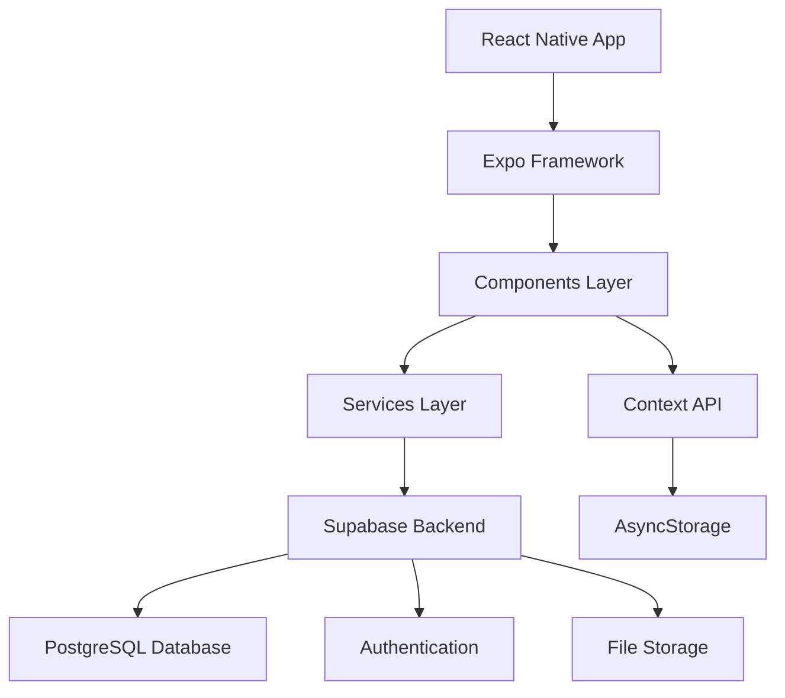

<div align="center">
  


  <h2>🐾 PetCare Pro</h2>

  <p><strong>מערכת שלמה לניהול מרפאות וטרינריות וחנויות חיות</strong></p>
  [](https://reactnative.dev/)
  [](https://expo.dev/)
  [](https://supabase.com/)
  [](https://www.typescriptlang.org/)
  [](#-רישיון)
  [](https://github.com)
  [](https://github.com)

  **פתרון מודרני ומלא לניהול וטרינרי שהופך את הטיפול בבעלי חיים ליעיל ונגיש יותר**

  [🌟 הדגמה מקוונת](https://petcareai.com.br) • [📚 תיעוד](https://documentation.petcareai.com.br/) • [💬 תמיכה](https://github.com/petcareai/consultorio-app/issues) • [🐛 דוח באגים](https://github.com/petcareai/consultorio-app/issues/new)

</div>

---

<div align="center">

  <h4>📱 הורד</h4>
  <a href="https://play.google.com/store/apps/details?id=com.petcareai.app"></a> <a href="https://apps.apple.com/br/app/petcare-ai/id123456789"></a> <a href="https://apt.izzysoft.de/packages/com.petcareai.app/"></a> <a href="https://f-droid.org/en/packages/com.petcareai.app/"></a> <a href="https://www.openapk.net/petcare-ai/com.petcareai.app/"></a> <a href="https://www.androidfreeware.net/download-petcare-ai-apk.html"></a> <a href="https://github.com/PetCareAi/app/releases"></a> <a href="https://expo.dev/@petcareai/petcare-app"></a>

</div>

---

## 📋 אינדקס

- [🎯 אודות הפרויקט](#-אודות-הפרויקט)
- [📱 צילומי מסך של האפליקציה](#-צילומי-מסך-של-האפליקציה)
- [🚀 תכונות](#-תכונות)
- [🛠️ טכנולוגיות](#️-טכנולוגיות)
- [📱 תאימות](#-תאימות)
- [🏗️ אדריכלות](#️-אדריכלות)
- [📁 מבנה הפרויקט](#-מבנה-הפרויקט)
- [⚡ התקנה ותצורה](#-התקנה-ותצורה)
- [🎮 כיצד להשתמש](#-כיצד-להשתמש)
- [📊 תכונות עיקריות](#-תכונות-עיקריות)
- [🎨 מערכת עיצוב](#-מערכת-עיצוב)
- [📘 סקריפטים זמינים](#-סקריפטים-זמינים)
- [🔧 תצורת סביבה](#-תצורת-הסביבה)
- [🗄️ מסד נתונים](#️-מסד-נתונים)
- [🔗 קישורים חשובים](#-קישורים-חשובים)
- [📈 מפת דרכים](#-מפת-דרכים)
- [🤝 תרומה](#-תרומה)
- [👥 צוות פיתוח](#-צוות-פיתוח)
- [📜 רישיון](#-רישיון)
- [🙏 תודה](#-תודה)
- [💬 תמיכה](#-תמיכה)
- [📱 רשתות חברתיות](#-רשתות-חברתיות)

---

## 🎯 על הפרויקט

**PetCare Pro** היא מערכת שלמה ומודרנית שפותחה במיוחד עבור וטרינרים ברזילאים שרוצים לבצע דיגיטציה ואופטימיזציה של ניהול המרפאות הווטרינריות וחנויות החיות שלהם.
### 🌟 למה PetCare Pro?

בשוק הווטרינרי הצומח ללא הרף בברזיל, עם יותר מ-149 מיליון חיות מחמד (על פי Instituto Pet Brasil), הדיגיטליזציה של תהליכים הפכה חיונית עבור:

- **יעילות תפעולית**: צמצם את הזמן המושקע במשימות אדמיניסטרטיביות
- **השירות הטוב ביותר**: גישה מהירה להשלמת היסטוריית המטופלים
- **ניהול פיננסי**: בקרת הכנסות ונהלים שבוצעו
- **ארגון**: מערכת מרכזית ללקוחות, חיות מחמד וייעוץ
- **ניידות**: גישה למידע בכל מקום

### 🎯 המטרה העיקרית

ספק פתרון **חינם**, **אינטואיטיבי** ו**שלם** המאפשר לוטרינרים להתמקד במה שהם עושים הכי טוב: **טיפול בבעלי חיים**.

---
## 📱 צילומי מסך של האפליקציה

### 🔐 אימות ותחילת העבודה

<div align="center">
  <table>
    <tr>
      <td align="center">
        
        <br />
        <strong>התחברות מקצועית</strong>
        <br />
<small>גישה בטוחה לוטרינרים</small>
      </td>
      <td align="center">
        
        <br />
        <strong>רישום וטרינרי</strong>
        <br />
        <small>רישום עם CRMV ונתונים מקצועיים</small>
      </td>
<td align="center">
        
        <br />
        <strong>מרכז שליטה ראשי</strong>
        <br />
        <small>סקירה כללית של המרפאה</small>
      </td>
    </tr>
  </table>
</div>

### 👥 ניהול לקוחות וחיות מחמד

<div align="center">
  <table>
<tr>
      <td align="center">
        
        <br />
        <strong>ניהול לקוחות</strong>
        <br />
        <small>רשימה מלאה של מורים</small>
      </td>
      <td align="center">

        <br />
        <strong>לקוח חדש</strong>
        <br />
        <small>רישום מפורט של מורים</small>
      </td>
      <td align="center">

        <br />
        <strong>ניהול חיות מחמד</strong>
        <br />
        <small>מטופלי מרפאה</small>
      </td>
    </tr>
  </table>
</div>

### 🐾 רישום וטיפול בחיות מחמד

<div align="center">
  <table>
    <tr>
      <td align="center">

        <br />
        <strong>רישום חיות מחמד</strong>
        <br />
        <small>רישום מטופל מלא</small>
      </td>
      <td align="center">

        <br />
        <strong>סדר יום וטרינרי</strong>
        <br />
        <small>יומן שירות</small>
      </td>
      <td align="center">

        <br />
        <strong>תזמן פגישה</strong>
        <br />
        <small>מערכת תזמון</small>
      </td>
    </tr>
  </table>
</div>

### 📚 ספרייה וטרינרית

<div align="center">
  <table>
    <tr>
<td align="center">
        
        <br />
        <strong>ספרייה וטרינרית</strong>
        <br />
        <small>תרופות, חיסונים ונהלים</small>
      </td>
      <td align="center">

        <br />
        <strong>פריט חדש</strong>
        <br />
        <small>רישום תרופות</small>
      </td>
      <td align="center" style="opacity: 0.7;">
<div style="width: 200px; height: 356px; background: linear-gradient(135deg, #2E7D32 0%, #4CAF50 100%); border-radius: 10px; display: flex; align-items: center; justify-content: center; color:wealign: center; color:wealign: bold;
          <div>
            <div style="font-size: 48px; margin-bottom: 10px;">💊</div>
            <div>דרישות<br/>דיגיטליות</div>
<div style="font-size: 12px; margin-top: 5px; opacity: 0.8;">V1.2</div>
          </div>
        </div>
        <br />
        <strong>Sistema de Prescrições</strong>
      </td>
    </tr>
  </table>
</div>

### 👤 תצורות פרופיל

<div align="center">
  <table>
    <tr>
      <td align="center">

        <br />
        <strong>פרופיל מקצועי</strong>
        <br />
        <small>פרטים וטרינרים</small>
      </td>
      <td align="center">

        <br />
        <strong>ערוך פרופיל</strong>
        <br />
        <small>עדכון נתונים</small>
      </td>
      <td align="center">

        <br />
        <strong>אבטחה</strong>
        <br />
        <small>שינוי סיסמה</small>
      </td>
    </tr>
  </table>
</div>

### ⚙️ הגדרות ותמיכה

<div align="center">
  <table>
    <tr>
      <td align="center">

        <br />
        <strong>גיבוי ושחזור</strong>
        <br />
        <small>אבטחת נתונים</small>
      </td>
      <td align="center">

        <br />
        <strong>עזרה ותמיכה</strong>
        <br />
        <small>מוקד טלפוני</small>
      </td>
      <td align="center">

        <br />
        <strong>על PetCare Pro</strong>
        <br />
        <small>פרטי יישום</small>
      </td>
    </tr>
  </table>
</div>

### 📋 מידע ומדיניות

<div align="center">
  <table>
    <tr>
      <td align="center">

        <br />
        <strong>מדיניות פרטיות</strong>
        <br />
        <small>LGPD והגנה על נתונים</small>
      </td>
      <td align="center">

        <br />
        <strong>מידע על גרסה</strong>
        <br />
        <small>עדכונים ויומן שינויים</small>
      </td>
      <td align="center" style="opacity: 0.7;">
<div style="width: 200px; height: 356px; background: linear-gradient(135deg, #81C784 0%, #66BB6A 100%); border-radius: 10px; display: flex; align-items: center; justify-content: center; color:weight: bold: center; color:wealign: bold;
          <div>
            <div style="font-size: 48px; margin-bottom: 10px;">📊</div>
            <div>Relatórios<br/>Detalhados</div>
<div style="font-size: 12px; margin-top: 5px; opacity: 0.8;">גרסה הבאה</div>
          </div>
        </div>
        <br />
        <strong>דוחות וניתוחים</strong>
      </td>
    </tr>
  </table>
</div>

### 📋 סיכום פונקציונלי לפי קטגוריה

| קטגוריה | תכונות | מסכים זמינים |
|-----------|----------------|------------------------|
| 🔐 **אימות** | כניסה מאובטחת, רישום מקצועי, לוח מחוונים | 3 |
| 👥 **ניהול לקוחות** | CRUD מלא, חיפוש מתקדם | 2 |
| 🐾 **ניהול חיות מחמד** | רישום מפורט, היסטוריה רפואית | 2 |
| 📅 **תורים** | מערכת סדר יום, הזמנת תורים | 2 |
| 📚 **ספרייה** | תרופות, חיסונים, נהלים | 2 |
| 👤 **פרופיל** | נתונים מקצועיים, אבטחה | 3 |
| ⚙️ **הגדרות** | גיבוי, תמיכה, מידע | 3 |
| 📋 **מידע** | מדיניות, גרסת האפליקציה | 2 |
| **סך הכל מיושם** | | **19 מסכים** |

---

## 🚀 תכונות

### ✅ תכונות מיושמות

| מודול | פונקציונליות | סטטוס |
|--------|----------------|--------|
| 🔐 **אימות** | מערכת כניסה/רישום מלאה | ✅ השלם |
| 📊 **לוח מחוונים** | נתונים סטטיסטיים בזמן אמת | ✅ השלם |
| 👥 **ניהול לקוחות** | השלם CRUD עם אימותים | ✅ השלם |
| 🐾 **ניהול חיות מחמד** | רישום מפורט והיסטורי | ✅ השלם |
| 📋 **התייעצויות** | שיא נוכחות מלא | ✅ השלם |
| 📅 **סדר יום** | מערכת תורים | ✅ השלם |
| 📚 **ספרייה וטרינרית** | תרופות, חיסונים ונהלים | ✅ השלם |
| 📱 **ממשק רספונסיבי** | עיצוב מודרני ואינטואיטיבי | ✅ השלם |
| 💾 **אחסון** | מסד נתונים איתן (Supabase) | ✅ השלם |
| ✅ **אימות** | טפסים עם אימות מלא | ✅ השלם |
| 🔄 **מדינות** | טעינה, שגיאה והצלחה | ✅ השלם |

### 🚧 בפיתוח
| פונקציונליות | תחזית | עדיפות |
|----------------|--------|----------------|
| 📧 **הודעות פוש** | v1.1.0 | גבוה |
| 📊 **דוחות PDF** | v1.2.0 | גבוה |
| ☁️ **גיבוי בענן** | v1.2.0 | ממוצע |
| 🔄 **סנכרון ריבוי מכשירים** | v1.3.0 | ממוצע |
| 📱 **אפליקציה ללקוחות** | v2.0.0 | נמוך |
| 🏥 **מולטי-קליניקה** | v2.0.0 | נמוך |

---

## 🛠️ טכנולוגיות

### 🎯 טכנולוגיות ליבה
| טכנולוגיה | גרסה | מטרה |
|------------|----------------|--------|
| **React Native** | 0.79.2 | מסגרת ליבה לפיתוח נייד |
| **Expo SDK** | 53.0.9 | פיתוח ובניית פלטפורמה |
| **Supabase** | 2.39.0 | Backend-as-a-Service (BaaS) |
| **ניווט תגובה** | v6 | ניווט בין מסכים |
| **AsyncStorage** | 2.1.2 | אחסון מקומי |

### 🎨 ספריות ממשק משתמש/UX
| ספריה | גרסה | פונקציונליות |
|------------|--------|----------------|
| **אקספו וקטור אייקונים** | 14.1.0 | אייקונים וקטורים |
| **מטפל מחוות יליד תגובה** | 2.24.0 | מחוות ואינטראקציות |
| **React Native Reanimated** | 3.17.4 | אנימציות נוזליות |
| **Linear Gradient Expo** | 14.1.4 | שיפועים חזותיים |
| **להגיב בהקשר של אזור בטוח יליד** | 5.4.0 | אזור מאובטח למכשירים |
### 🔧 כלי פיתוח

| כלי | גרסה | מטרה |
|------------|----------------|--------|
| **Babel Core** | 7.20.0 | טרנספילציה של JavaScript |
| **בוחר ילידים תגובה** | 2.11.0 | בוררים נפתחים |
| **בורר תמונות אקספו** | 15.0.7 | בחירת תמונה |
| **Expo Splash Screen** | 0.29.9 | מסך טעינה |

### 🗄️ מסד נתונים וגב

| שירות | פונקציונליות |
|--------|----------------|
| **Supabase PostgreSQL** | מסד נתונים ראשי |
| **Supabase Auth** | אימות משתמש |
| **אחסון Supabase** | אחסון קבצים |
| **Supabase Realtime** | סנכרון בזמן אמת |

---

## 📱 תאימות

### 📋 דרישות מערכת

| פלטפורמה | גרסה מינימלית | סטטוס |
|------------|-------------|--------|
| **iOS** | 12.0+ | ✅ תמיכה מלאה |
| **אנדרואיד** | API 21+ (אנדרואיד 5.0) | ✅ תמיכה מלאה |
| **אקספו גו** | הגרסה האחרונה | ✅ פיתוח ובדיקה |
| **Expo Development Build** | - | ✅ בנייה בהתאמה אישית |

### 🎯 מכשירים שנבדקו

- **iOS**: iPhone 12+, iPad Air 4+
- **אנדרואיד**: Samsung Galaxy S21+, Pixel 6+
- **טאבלטים**: תמיכה מלאה בתגובות

---

## 🏗️ אדריכלות

### 📐 דפוסים אדריכליים

### 🔄 זרימת נתונים

1. **רכיבי ממשק משתמש** ← אינטראקציית משתמש
2. **Context API** → ניהול מצב גלובלי
3. **שירותים** → לוגיקה עסקית וקריאות API
4. **Supabase** ← Backend והתמדה
5. **AsyncStorage** ← מטמון מקומי

---

## 📁 מבנה הפרויקט
```
📁 consultorio-app/
├── 🪝 .githooks/                          # Scripts de automação Git customizados
│   ├── 🪝 commit-msg                          # Hook para validação de mensagens de commit
│   ├── 🪝 pre-commit                          # Hook executado antes de cada commit
│   └── 🪝 pre-push                            # Hook executado antes de cada push
├── 📁 src/                                # Código fonte principal da aplicação
│   ├── 🧩 components/                         # Componentes de interface reutilizáveis
│   │   └── 📁 common/
│   │       ├── ⚡ Button.js                           # Script JavaScript
│   │       ├── ⚡ Card.js                             # Script JavaScript
│   │       ├── ⚡ Input.js                            # Script JavaScript
│   │       ├── ⚡ Loading.js                          # Script JavaScript
│   │       └── ⚡ SearchBar.js                        # Script JavaScript
│   ├── ⚙️ config/                             # Arquivos de configuração
│   │   └── ⚡ supabase.js                         # Script JavaScript
│   ├── 📁 constants/
│   │   ├── ⚡ Colors.js                           # Script JavaScript
│   │   ├── ⚡ Data.js                             # Script JavaScript
│   │   └── ⚡ Storage.js                          # Script JavaScript
│   ├── 📁 contexts/
│   │   └── ⚡ AuthContext.js                      # Script JavaScript
│   ├── 📁 navigation/
│   │   ├── ⚡ AppNavigator.js                     # Script JavaScript
│   │   ├── ⚡ AuthNavigator.js                    # Script JavaScript
│   │   └── ⚡ MainNavigator.js                    # Script JavaScript
│   ├── 📱 screens/                            # Telas da aplicação (mobile/desktop)
│   │   ├── 📁 agenda/
│   │   │   ├── ⚡ AgendaScreen.js                     # Script JavaScript
│   │   │   └── ⚡ NewAppointmentScreen.js             # Script JavaScript
│   │   ├── 🔐 auth/                               # Autenticação e autorização
│   │   │   └── ⚡ LoginScreen.js                      # Script JavaScript
│   │   ├── 📁 clients/
│   │   │   ├── ⚡ ClientListScreen.js                 # Script JavaScript
│   │   │   └── ⚡ NewClientScreen.js                  # Script JavaScript
│   │   ├── 📁 consultations/
│   │   │   └── ⚡ NewConsultationScreen.js            # Script JavaScript
│   │   ├── 📁 library/
│   │   │   └── ⚡ VetLibraryScreen.js                 # Script JavaScript
│   │   ├── 📁 pets/
│   │   │   ├── ⚡ NewPetScreen.js                     # Script JavaScript
│   │   │   └── ⚡ PetListScreen.js                    # Script JavaScript
│   │   ├── 📁 profile/
│   │   │   ├── ⚡ AboutScreen.js                      # Script JavaScript
│   │   │   ├── ⚡ BackupSettingsScreen.js             # Script JavaScript
│   │   │   ├── ⚡ ChangePasswordScreen.js             # Script JavaScript
│   │   │   ├── ⚡ EditProfileScreen.js                # Script JavaScript
│   │   │   ├── ⚡ HelpSupportScreen.js                # Script JavaScript
│   │   │   ├── ⚡ NotificationSettingsScreen.js       # Script JavaScript
│   │   │   ├── ⚡ PrivacyScreen.js                    # Script JavaScript
│   │   │   ├── ⚡ ProfileScreen.js                    # Script JavaScript
│   │   │   └── ⚡ VersionInfoScreen.js                # Script JavaScript
│   │   ├── ⚡ AppointmentDetailsScreen.js         # Script JavaScript
│   │   ├── ⚡ HomeScreen.js                       # Script JavaScript
│   │   └── ⚡ PatientDetailsScreen.js             # Script JavaScript
│   ├── ⚙️ services/                           # Serviços e integrações externas
│   │   ├── ⚡ AppointmentService.js               # Script JavaScript
│   │   ├── ⚡ AuthService.js                      # Script JavaScript
│   │   ├── ⚡ BackupService.js                    # Script JavaScript
│   │   ├── ⚡ ClientService.js                    # Script JavaScript
│   │   ├── ⚡ ConsultationService.js              # Script JavaScript
│   │   ├── ⚡ LibraryService.js                   # Script JavaScript
│   │   ├── ⚡ NotificationService.js              # Script JavaScript
│   │   └── ⚡ PetService.js                       # Script JavaScript
│   ├── 🎨 styles/                             # Arquivos de estilo CSS/SCSS
│   │   └── ⚡ globalStyles.js                     # Script JavaScript
│   └── 🔧 utils/                              # Utilitários e funções genéricas
│       ├── ⚡ helpers.js                          # Script JavaScript
│       ├── ⚡ storage.js                          # Script JavaScript
│       └── ⚡ validators.js                       # Script JavaScript
├── 📦 assets/                             # Recursos da aplicação (imagens, ícones, etc)
│   ├── 📁 screenshots/
│   │   ├── 🖼️ add_biblioteca.png                  # Imagem PNG otimizada
│   │   ├── 🖼️ add_paciente.png                    # Imagem PNG otimizada
│   │   ├── 🖼️ agenda.png                          # Imagem PNG otimizada
│   │   ├── 🖼️ ajuda_e_suporte.png                 # Imagem PNG otimizada
│   │   ├── 🖼️ alterar_senha.png                   # Imagem PNG otimizada
│   │   ├── 🖼️ backup_e_restauracao.png            # Imagem PNG otimizada
│   │   ├── 🖼️ biblioteca.png                      # Imagem PNG otimizada
│   │   ├── 🖼️ cadastrar_pet.png                   # Imagem PNG otimizada
│   │   ├── 🖼️ clients.png                         # Imagem PNG otimizada
│   │   ├── 🖼️ editar_perfil.png                   # Imagem PNG otimizada
│   │   ├── 🖼️ home.png                            # Imagem PNG otimizada
│   │   ├── 🖼️ login.png                           # Imagem PNG otimizada
│   │   ├── 🖼️ novo_agendamento.png                # Imagem PNG otimizada
│   │   ├── 🖼️ perfil.png                          # Imagem PNG otimizada
│   │   ├── 🖼️ pets.png                            # Imagem PNG otimizada
│   │   ├── 🖼️ politicas_de_privacidade.png        # Imagem PNG otimizada
│   │   ├── 🖼️ registro.png                        # Imagem PNG otimizada
│   │   ├── 🖼️ sobre.png                           # Imagem PNG otimizada
│   │   └── 🖼️ version.png                         # Imagem PNG otimizada
│   ├── 🖼️ adaptive-icon.png                   # Imagem PNG otimizada
│   ├── 🖼️ adaptive-icon0.png                  # Imagem PNG otimizada
│   ├── 🖼️ favicon.png                         # Imagem PNG otimizada
│   ├── 🖼️ icon.png                            # Imagem PNG otimizada
│   ├── 🖼️ logo.png                            # Imagem PNG otimizada
│   ├── 🖼️ splash-icon.png                     # Imagem PNG otimizada
│   ├── 🖼️ splash.png                          # Imagem PNG otimizada
│   └── 🖼️ splash0.png                         # Imagem PNG otimizada
├── 🗄️ db/                                 # Arquivos relacionados ao banco de dados
│   └── 📄 supabase.sql                        # Script SQL de banco de dados
├── 📜 CHANGELOG.md                        # Histórico detalhado de mudanças e versões
├── 📜 LICENSE                             # Licença de uso e distribuição do software
├── 📖 README.md                           # Documentação principal e guia de introdução
├── 📦 package.json                        # Dependências e scripts do projeto NPM
├── 📝 .editorconfig                       # Configuração de formatação entre editores
├── ⚙️ .gitattributes                      # Atributos específicos de arquivos no Git
├── 🚫 .gitignore                          # Arquivos e pastas ignorados pelo Git
├── ⚙️ .markdownlint.yml                   # Configuração YAML
├── 🪝 .pre-commit-config.yaml             # Configuração de hooks pre-commit
├── 🔧 .travis.yml                         # Configuração do Travis CI
├── 🏷️ .version                            # Número da versão atual do projeto
├── ⚛️ App.js                              # Componente raiz da aplicação React
├── ⚙️ app.json                            # Dados estruturados JSON
├── 📝 ARCHITECTURE.md                     # Documentação em Markdown
├── 🏗️ BUILDING.md                         # Instruções detalhadas para build do projeto
├── 📚 citation.cff                        # Formato de citação para trabalhos acadêmicos
├── 📜 CODE_OF_CONDUCT.md                  # Código de conduta da comunidade
├── 👥 CODEOWNERS                          # Definição de responsáveis por áreas do código
├── 📝 commitlint.config.js                # Regras para validação de commits
├── ⚙️ configure.sh                        # Script de configuração do ambiente
├── 🤝 CONTRIBUTING.md                     # Guia para contribuidores do projeto
├── 👥 CONTRIBUTORS.md                     # Lista de pessoas que contribuíram
├── 👥 contributors.yml                    # Dados estruturados dos contribuidores
├── ©️ COPYRIGHT                           # Informações de direitos autorais
├── 🤖 dependabot.yml                      # Configuração do Dependabot para atualizações
├── 📝 git-build-commit.md                 # Documentação em Markdown
├── 🚀 index.js                            # Ponto de entrada principal da aplicação
├── 💾 install.sh                          # Script de instalação automática
├── 🛠️ MAINTAINING.md                      # Guia para mantenedores do projeto
├── 🔨 Makefile                            # Automação de build e tarefas do projeto
├── 📋 MANIFEST.in                         # Especificação de arquivos para distribuição
├── 🚀 release.md                          # Notas e planejamento de releases
├── 📋 requisitos-funcionais.md            # Especificação dos requisitos funcionais
├── 📋 requisitos.md                       # Documentação de requisitos do sistema
├── 🗺️ Roadmap.md                          # Planejamento e cronograma de funcionalidades
├── 🚀 run.sh                              # Script para execução da aplicação
├── 🛡️ SECURITY.md                         # Política de segurança e vulnerabilidades
├── ⚡ struct.js                           # Script JavaScript
├── 📝 TODO.md                             # Lista de tarefas pendentes e melhorias
└── 🔧 TROUBLESHOOTING.md                  # Guia de resolução de problemas comuns
```
---

## ⚡ התקנה ותצורה

### 📋 דרישות מוקדמות

ודא שהתקנת:

- **Node.js** (גרסה 18.0.0 ומעלה)
- **npm** או **חוט**
- **Expo CLI** (מומלץ: הגרסה האחרונה)
- **גיט**
```bash
# Verificar versões
node --version    # v18.0.0+
npm --version     # 8.0.0+
expo --version    # 49.0.0+
```
### 🚀 התקנה מהירה

#### אפשרות 1: שיבוט מאגר
```bash
# 1. Clone o repositório
git clone https://github.com/PetCareAi/consultorio-app.git

# 2. Entre no diretório
cd consultorio-app

# 3. Instale as dependências
npm install
# ou
yarn install

# 4. Configure o banco de dados (ver seção Database)

# 5. Inicie o projeto
npm start
# ou
expo start
```
### ⚙️ תצורת Supabase

1. **צור חשבון ב-Supabase**: [https://supabase.com](https://supabase.com)

2. **צור פרויקט חדש**:
   - שם: `PetCare Pro`
   - אזור: `דרום אמריקה (סאו פאולו)`
   - סיסמת בנק: (בחר סיסמה חזקה)

3. **הפעל סקריפט בנק**:
   ```sql
   -- Execute o conteúdo do arquivo db/supabase.sql
   -- no SQL Editor do Supabase
   ```
4. **הגדר אישורים**:
   ```javascript
   // src/config/supabase.js
   const supabaseUrl = 'SUA_URL_DO_SUPABASE'
   const supabaseAnonKey = 'SUA_CHAVE_PUBLICA'
   ```
---

## 🎮 כיצד להשתמש

### 🔐 גישה ראשונה

1. **פתח את האפליקציה**
2. **השתמש באישורי הדגמה**:
   - 📧 **דוא"ל**: `admin@petcare.com`
   - 🔒 **סיסמה**: `123456`
3. **או צור חשבון חדש** על ידי לחיצה על "הירשם"

### 🏠 לוח המחוונים הראשי

לוח המחוונים מציע סקירה מלאה:

- **📊 נתונים סטטיסטיים בזמן אמת**
- **📅 סדר היום של היום**
- **⚡ פעולות מהירות**
- **📈 מדדים חשובים**
### 👥 ניהול לקוחות

#### ➕ הוסף לקוח
1. נווט אל **לקוחות** → **חדש**
2. מלא את נתוני החובה:
   - שם מלא
   - אימייל
   - טלפון
3. נתונים אופציונליים:
   - CPF, כתובת, הערות

#### 🔍 חפש לקוחות
- השתמש בסרגל החיפוש
- חפש לפי: שם, מייל, טלפון, CPF

### 🐾 ניהול חיות מחמד

#### ➕ רישום חיית מחמד
1. **לקוחות** → בחר לקוח → **חיית מחמד חדשה**
2. מידע בסיסי:
   - שמה של חיית המחמד
   - מינים (כלב, חתול וכו')
   - גזע
   - סקס
3. פרטים פיזיים:
   - תאריך לידה
   - משקל
   - צבע
   - שבב

---

## 📊 תכונות עיקריות

### 🔐 מערכת אימות
```javascript
// Exemplo de uso
const { login, register, logout, user } = useAuth();

// Login
const result = await login('email@exemplo.com', 'senha123');

// Verificar se está autenticado
if (user) {
  // Usuário logado
}
```
### 📊 לוח מחוונים אינטראקטיבי

- **סטטיסטיקה בזמן אמת**
- **גרפים ומדדים**
- **סדר היום**
- **פעולות מהירות**
- **תזכורות חשובות**

### 👥 ניהול לקוחות מלא
```javascript
// Exemplo de operações CRUD
import { ClientService } from '../services/ClientService';

// Listar clientes
const clients = await ClientService.getAll();

// Criar cliente
const result = await ClientService.create(clientData);

// Buscar cliente
const clients = await ClientService.search('João');
```
---

## 🎨 מערכת עיצוב

### 🎨 פלטת צבעים
```javascript
// Cores principais
const Colors = {
  primary: '#2E7D32',        // Verde veterinário principal
  primaryDark: '#1B5E20',    // Verde escuro
  primaryLight: '#4CAF50',   // Verde claro
  secondary: '#81C784',      // Verde secundário
  accent: '#66BB6A',         // Verde destaque
  
  // Cores de superfície
  background: '#F1F8E9',     // Fundo principal
  surface: '#FFFFFF',        // Superfícies de cartões
  
  // Cores de status
  error: '#F44336',          // Erro/perigo
  warning: '#FF9800',        // Aviso
  info: '#2196F3',          // Informação
  success: '#4CAF50',       // Sucesso
  
  // Cores de texto
  text: '#212121',          // Texto principal
  textSecondary: '#757575', // Texto secundário
  border: '#E0E0E0',        // Bordas
};
```
### 🧩 רכיבים

#### רכיב לחצן
```javascript
<Button 
  title="Salvar"
  variant="primary"        // primary, secondary, outline, danger
  size="medium"           // small, medium, large
  loading={false}
  onPress={handleSave}
  icon={<Ionicons name="save" />}
/>
```
#### רכיב קלט
```javascript
<Input 
  label="Nome"
  placeholder="Digite o nome"
  leftIcon="person"
  error="Campo obrigatório"
  required
  multiline={false}
/>
```
---

## 📘 סקריפטים זמינים

### 🚀 סקריפטים לפיתוח
```bash
# Iniciar servidor de desenvolvimento
npm start

# Executar no iOS Simulator
npm run ios

# Executar no Android Emulator
npm run android

# Executar na web
npm run web

# Setup inicial do projeto
npm run setup

# Resetar cache e dependências
npm run reset

# Gerar build para produção
npm run prebuild
```
---

## 🔧 תצורת סביבה

### ☁️ תצורת Supabase

#### 1. הגדרה ראשונית
```javascript
// src/config/supabase.js
import { createClient } from '@supabase/supabase-js';

const supabaseUrl = 'https://seu-projeto.supabase.co';
const supabaseAnonKey = 'sua-chave-publica';

export const supabase = createClient(supabaseUrl, supabaseAnonKey, {
  auth: {
    autoRefreshToken: true,
    persistSession: true,
    detectSessionInUrl: false,
  },
});
```
#### 2. הגדרת מדיניות RLS
```sql
-- Habilitar RLS (Row Level Security)
ALTER TABLE users_consultorio ENABLE ROW LEVEL SECURITY;
ALTER TABLE clients_consultorio ENABLE ROW LEVEL SECURITY;
ALTER TABLE pets_consultorio ENABLE ROW LEVEL SECURITY;
ALTER TABLE consultations_consultorio ENABLE ROW LEVEL SECURITY;
ALTER TABLE appointments_consultorio ENABLE ROW LEVEL SECURITY;

-- Políticas de exemplo
CREATE POLICY "Users can view own data" ON clients_consultorio
  FOR SELECT USING (user_id = auth.uid());
```
---

## 🗄️ מסד נתונים

### 📊 סכימה ראשית
```sql
-- Usuários (Veterinários)
CREATE TABLE users_consultorio (
  id UUID PRIMARY KEY,
  email VARCHAR(255) UNIQUE NOT NULL,
  name VARCHAR(255) NOT NULL,
  profession VARCHAR(100) DEFAULT 'Veterinário(a)',
  clinic VARCHAR(255),
  crmv VARCHAR(50),
  phone VARCHAR(20),
  photo_url TEXT,
  created_at TIMESTAMP WITH TIME ZONE DEFAULT NOW(),
  updated_at TIMESTAMP WITH TIME ZONE DEFAULT NOW()
);

-- Clientes
CREATE TABLE clients_consultorio (
  id UUID DEFAULT gen_random_uuid() PRIMARY KEY,
  user_id UUID NOT NULL REFERENCES users_consultorio(id),
  name VARCHAR(255) NOT NULL,
  email VARCHAR(255) NOT NULL,
  phone VARCHAR(20) NOT NULL,
  cpf VARCHAR(14),
  address TEXT,
  city VARCHAR(100),
  state VARCHAR(2),
  zip_code VARCHAR(10),
  notes TEXT,
  created_at TIMESTAMP WITH TIME ZONE DEFAULT NOW(),
  updated_at TIMESTAMP WITH TIME ZONE DEFAULT NOW()
);

-- Pets
CREATE TABLE pets_consultorio (
  id UUID DEFAULT gen_random_uuid() PRIMARY KEY,
  client_id UUID NOT NULL REFERENCES clients_consultorio(id),
  name VARCHAR(255) NOT NULL,
  species VARCHAR(50) NOT NULL,
  breed VARCHAR(100),
  gender VARCHAR(10) NOT NULL,
  birth_date DATE,
  weight DECIMAL(5,2),
  color VARCHAR(100),
  microchip VARCHAR(50),
  photo_url TEXT,
  notes TEXT,
  created_at TIMESTAMP WITH TIME ZONE DEFAULT NOW(),
  updated_at TIMESTAMP WITH TIME ZONE DEFAULT NOW()
);

-- Consultas
CREATE TABLE consultations_consultorio (
  id UUID DEFAULT gen_random_uuid() PRIMARY KEY,
  client_id UUID NOT NULL REFERENCES clients_consultorio(id),
  pet_id UUID NOT NULL REFERENCES pets_consultorio(id),
  user_id UUID NOT NULL REFERENCES users_consultorio(id),
  type VARCHAR(100) NOT NULL,
  date TIMESTAMP WITH TIME ZONE NOT NULL,
  symptoms TEXT,
  diagnosis TEXT,
  treatment TEXT,
  prescription TEXT,
  observations TEXT,
  follow_up_date TIMESTAMP WITH TIME ZONE,
  weight DECIMAL(5,2),
  temperature DECIMAL(4,1),
  heart_rate INTEGER,
  price DECIMAL(10,2) DEFAULT 0,
  created_at TIMESTAMP WITH TIME ZONE DEFAULT NOW(),
  updated_at TIMESTAMP WITH TIME ZONE DEFAULT NOW()
);
```
---

## 🔗 קישורים חשובים

### 📚 משאבים רשמיים
- 🌐 **אתר רשמי:** https://language.petcareai.com.br/
- 📖 **תיעוד:** https://language.petcareai.com.br/docs
- 🎓 **הדרכות:** https://language.petcareai.com.br/tutorials
- 📦 **חבילת NPM:** https://www.npmjs.com/package/petcarescript
- 🧩 **הרחבת קוד VS:** https://marketplace.visualstudio.com/items?itemName=petcarescript.petcarescript
### 🛠️ Desenvolvimento
- 💻 **מאגר GitHub:** https://github.com/PetCareAi/petcarescript
- 🐛 **בעיות ובאגים:** https://github.com/PetCareAi/petcarescript/issues
- 💬 **דיונים:** https://github.com/PetCareAi/petcarescript/discussions
- 🔄 ** בקשות למשוך:** https://github.com/PetCareAi/petcarescript/pulls
- 📊 **לוח הפרויקט:** https://github.com/PetCareAi/petcarescript/projects
### 🌐 PetCareAI אקולוגי

| משאב | קישור | תיאור |
|--------|------|--------|
| 🌍 **האתר הרשמי** | [petcareai.com.br](https://petcareai.com.br) | פורטל ראשי |
| 🏢 **GitHub Org** | [github.com/PetCareAI](https://github.com/PetCareAi) | 25+ מאגרים |
| 💬 **דיסקורד** | [discord.gg/petcareai](https://discord.gg/petcareai) | קהילה פעילה |
| 📚 **תיעוד** | [docs.petcareai.com.br](https://documentation.petcareai.com.br) | ויקי השלם |
| 📋 **משימות** | [tasks.petcareai.com.br](https://tasks.petcareai.com.br) | ניהול זריז |
| 📊 **אנליטיקס** | [analytics.petcareai.com.br](https://analytics.petcareai.com.br) | לוחות מחוונים |

---

## 📈 מפת דרכים

### 🎯 גרסה 1.1.0 (Q2 2025)
- [ ] 📧 **מערכת הודעות דחיפה**
- [ ] 🔄 **סנכרון לא מקוון**
- [ ] 📊 **דוחות בסיסיים ב-PDF**
- [ ] 🔐 **שחזור סיסמה**
- [ ] 👤 **פרופיל וטרינר מפורט**

### 🎯 גרסה 1.2.0 (Q3 2025)
- [ ] 📅 **תזמון מקוון ללקוחות**
- [ ] 🤖 **תזכורות אוטומטיות (WhatsApp/SMS)**
- [ ] 📱 **אפליקציה ייעודית ללקוחות**
- [ ] 💳 **שילוב עם אמצעי תשלום**
- [ ] 📋 **תבניות מרשם**
### 🧠 קטגוריית AI ולמידת מכונה
- **Ultra ML Pet Detection v6.0** - מערכת אולטרה מקצועית עם YOLO ו-MediaPipe
- **PetCareAI Analytics** - ניתוח מתקדם עם למידת מכונה
- **LLM AI Assistant** - עוזרים וירטואליים עם Gemini AI
- **מערכות ראיית מחשב** לניתוח וטרינרי

### 🔮 עתיד
- [ ] 🏆 **מערכת Gamification**
- [ ] 📺 **רפואה וטרינרית**
- [ ] 🔗 **בלוקצ'יין לתיעוד רפואי**
- [ ] 🎯 **למידת מכונה לתחזיות**

---

## 🤝 תרומה

תרומות תמיד יתקבלו בברכה! פרויקט זה הוא קוד פתוח ופותח עבור הקהילה הווטרינרית הברזילאית.

### 🚀 איך לתרום

#### 1. 🍴 Project Fork
```bash
# Fork no GitHub e clone
git clone https://github.com/seu-usuario/petcare-pro.git
cd petcare-pro
```
#### 2. 🌿 צור סניף
```bash
# Criar branch para feature
git checkout -b feature/nova-funcionalidade

# Criar branch para bugfix
git checkout -b bugfix/correcao-bug
```
#### 3. 💻 פיתוח
```bash
# Instalar dependências
npm install

# Executar em modo desenvolvimento
npm start

# Executar testes
npm test
```
### 📝 תבניות מחויבות

אנו פועלים לפי דפוס [התחייבויות קונבנציונליות](https://www.conventionalcommits.org/):
```bash
# Tipos de commit
feat:     # Nova funcionalidade
fix:      # Correção de bug
docs:     # Documentação
style:    # Formatação, sem mudança de código
refactor: # Refatoração de código
test:     # Adição ou correção de testes
chore:    # Manutenção geral
```
---

## 👥 צוות פיתוח

### **צוות ליבה**
- **Lead Tech** - אדריכלות ופיתוח עיקרי
- **מפתח נייד** - React Native Development
- **מפתח עורפי** - ממשקי API ומסד נתונים
- **מעצב UX/UI** - ממשק וניסיון

### 🚀 מנהיג טכני

<div align="center">
  
  <br />
<strong>Estevam Souza</strong><br />
  <em>Especialista TI Full-Stack</em><br />
  <a href="https://linkedin.com/in/estevam-souza">LinkedIn</a> |
  <a href="https://github.com/estevam5s">GitHub</a> |
  <a href="https://estevamsouza.com.br">אתר</a>
</div>

### 🚀 צוות ליבה

<table>
  <tr>
    <td align="center">
      
      <br />
<sub><b>João Silva</b></sub>
      <br />
      <sub>מפתח טכני ו-Full Stack Developer</sub>
      <br />
      <a href="mailto:joao@petcarepro.com">📧</a>
      <a href="https://linkedin.com/in/joao">💼</a>
    </td>
    <td align="center">
      
      <br />
      <sub><b>מריה סנטוס</b></sub>
      <br />
<sub>מעצב UI/UX ומפתח חזית</sub>
      <br />
      <a href="mailto:maria@petcarepro.com">📧</a>
      <a href="https://linkedin.com/in/maria">💼</a>
    </td>
    <td align="center">
      
      <br />
      <sub><b>דר. קרלוס מנדס</b></sub>
      <br />
      <sub>יועץ וטרינרי ובעל מוצר</sub>
      <br />
<a href="mailto:carlos@petcarepro.com">📧</a>
      <a href="https://linkedin.com/in/carlos">💼</a>
    </td>
  </tr>
</table>

### 🌟 תורמים

אנו מודים לכל [תורמים](CONTRIBUTORS.md) שעזרו לבנות את הפרויקט הזה.

<a href="https://github.com/petcare-pro/petcare-pro/graphs/contributors">
  
</a>
### 🤝 איך להצטרף לצוות

**אנחנו תמיד מחפשים כישרונות חדשים!**

- 📞 **דיסקורד**: [discord.gg/petcareai](https://discord.gg/petcareai)
- 💼 **LinkedIn**: [company/petcare-ai](https://linkedin.com/company/petcare-ai)
- 📧 **דוא"ל**: contato@petcareai.com.br

**שטחים פתוחים:**
- 👨‍💻 מפתחים (Frontend, Backend, Mobile)
- 🧠 מומחי AI/ML
- 🛡️ מהנדסי אבטחת סייבר
- 📊מדעני נתונים
- 🎨 מעצבי UI/UX
- 📈 שיווק דיגיטלי

---

## 📜 רישיון

פרויקט זה נמצא תחת [רישיון קנייני](LICENSE) מאת **PetCareAi Ltda**.

לרישוי והרשאות: **legal@petcareai.com.br**

### 📋 סיכום רישיון MIT

✅ **מותר:**
- ✅ שימוש מסחרי
- ✅ שינוי
- ✅ הפצה
- ✅ שימוש פרטי

❌ **הגבלות:**
- ❌ אחריות
- ❌ אחריות

📝 **תנאים:**
- 📝 כלול רישיון וזכויות יוצרים

---
## 🙏 תודה

### 🙏 **תודות מיוחדות**

- **Google** מאת Gemini 2.0 Flash API
- **Microsoft** עבור VS Code ו-API ההרחבות המעולה שלו
- **קהילת קוד פתוח** להשראה ומשוב מתמשך
- **בודקי בטא** לעזרה בשיפור התוסף
- **תורמים** שאיפשרו את הפרויקט הזה

### 🌟 **השראה**
- **GitHub Copilot** - השראה ל-AI משולב
- **חומר נושא סמל** - דפוסי איקונוגרפיה
- **נושא דרקולה** - השראה לנושאים אפלים
- **קהילת Vue.js** - שיטות עבודה מומלצות לפיתוח

### **טכנולוגיות וכלים**

- 🧠 **Google AI** - מאת Gemini API מהפכני
- 🔬 **TensorFlow Team** - על ידי פלטפורמת ה-ML המתקדמת ביותר
- ⚛️ **React Community** - למערכת האקולוגית המדהימה
- 📦 **קהילת קוד פתוח** - לכל הספריות בהן נעשה שימוש

### **אימות מדעי**

- 🏥 **בית חולים וטרינרי USP** - אימות אלגוריתמים
- 🎓 **FMVZ-USP** - ייעוץ מדעי
- 👨‍⚕️ **CFMV** - הנחיות אתיות וטכניות
- 🐕 **ANCLIVEPA** - תמיכה מהקהילה הווטרינרית

### **בודקי בטא**
תודה מיוחדת ל**500+ מורים** שהשתתפו בבדיקות בטא ועזרו לשכלל את ה-AI שלנו.

### 🏆 הכרות מיוחדות

- **🩺 המועצה האזורית לרפואה וטרינרית של סאו פאולו (CRMV-SP)** - ייעוץ טכני
- **🏥 מרפאה וטרינרית של VetCare** - בדיקות ומשוב תפקודי
- **👨‍💻 React Native Community** - תמיכה טכנית וספריות
- **☁️ צוות Supabase** - פלטפורמה עורפית חזקה
- **🎨 צוות אקספו** - מסגרת פיתוח יוצאת דופן

### פרויקטים שעוררו השראה

- [React](https://reactjs.org/) - ספריה לממשקים
- [אלקטרון](https://electronjs.org/) - מסגרת עבור אפליקציות שולחן עבודה
- [Supabase](https://supabase.com/) - Backend של קוד פתוח
- [Chart.js](https://chartjs.org/) - הדמיית נתונים
### 💝 **תמוך בפרויקט**

אהבתם את התוסף? שקול לתמוך בפיתוח:

- ⭐ **כוכב** ב-[GitHub](https://github.com/PetCareAi/extension-for-devs)
- 🐦 **שתף** ברשתות החברתיות
- 💰 **לתרום** דרך [קנה לי קפה](https://buymeacoffee.com/petcareai)
- 🤝 **תרום** עם קוד או תיעוד

---

## 💬 תמיכה

### 🆘 קבל עזרה
- **📖 תיעוד**: [petcarescript.org/docs](https://petcarescript.org/docs)
- **💬 קהילת דיסקורד**: [discord.gg/petcarescript](https://discord.gg/petcarescript)
- **❓ Stack Overflow**: תייגו את השאלות שלכם עם `petcarescript`
- **🐛 בעיות GitHub**: [דווח על באגים ובקשות לתכונות](https://github.com/petcarescript/vscode-extension/issues)

### 📞 צור קשר
- **📧 דוא"ל**: support@petcarescript.org
- **🐦 טוויטר**: [@PetCareScript](https://twitter.com/PetCareScript)
- **💼 LinkedIn**: [PetCareScript רשמי](https://linkedin.com/company/petcarescript)

### 🏢 תמיכה עסקית

ללקוחות עסקיים אנו מציעים:
- **⚡ תמיכה מועדפת** - סיוע טכני 24/7
- **🔧 תכונות מותאמות אישית** - כלי פיתוח בהתאמה אישית
- **📚 תכניות הדרכה** - הצטרפות לצוות וסדנאות
- **🛡️ ביקורת אבטחה** - ניתוח אבטחת קוד

צור קשר: enterprise@petcarescript.org

### 🆘 ערוצי תמיכה

| סוג התמיכה | ערוץ | תשובה |
|----------------|-------|--------|
| **🐛באגים ובעיות** | [בעיות GitHub](https://github.com/PetCareAi/consultorio-app/issues) | 24-48 שעות |
| **💬 דיונים** | [דיוני GitHub](https://github.com/PetCareAi/consultorio-app/discussions) | 24 שעות |
| **📧 תמיכה ישירה** | [support@petcareai.com.br](mailto:support@petcareai.com.br) | 24 שעות |
| **📖 תיעוד** | [documentation.petcareai.com.br](https://documentation.petcareai.com.br) | תמיד |

### 💬 ערוצי תקשורת

| ערוץ | מטרה | זמן תגובה |
|-------|--------|----------------|
| 📧 **מייל** | תמיכה כללית ומסחרית | 24-48 שעות |
| 💬 **וואטסאפ** | תמיכה טכנית דחופה | 2-8 שעות |
| 🐛 **בעיות GitHub** | באגים ובקשות תכונה | 1-3 ימים |
| 📱 **טלגרם** | קהילת משתמשים | זמן אמת |
| 📺 **יוטיוב** | הדרכות וחדשות | שבועי |

### 📧 אנשי קשר ישירים
- **🎯 תמיכה כללית**: [suporte@petcareai.com.br](mailto:suporte@petcareai.com.br)
- **🔧 תמיכה טכנית**: [tech@petcareai.com.br](mailto:tech@petcareai.com.br)
- **💼 שותפויות**: [parcerias@petcareai.com.br](mailto:parcerias@petcareai.com.br)
- **📰 לחץ**: [imprensa@petcareai.com.br](mailto:imprensa@petcareai.com.br)

### 🆘 תמיכה דחופה
למצבים קריטיים המונעים מהמרפאה לתפקד:

📞 **טלפון חירום**: (11) 9999-8888
💬 **וואטסאפ**: [wa.me/5511999998888](https://wa.me/5511999998888)

### 🚀 הדרכות וסדנאות

אנו מציעים הדרכה חינם כדי למקסם את השימוש במערכת:

#### 📅 לוח אימונים
- **🟢 בסיסי**: ימי שני בשעה 19:00 (01:00)
- **🟡 בינוני**: ימי רביעי בשעה 19:00 (1.5 שעות)
- **🔴 מתקדם**: ימי שישי בשעה 19:00 (2 לפנות בוקר)

#### 📋 נושאים מכוסים
- ✅ תחילת העבודה עם PetCare Pro
- ✅ ניהול יעיל של לקוחות וחיות מחמד
- ✅ רישום תורים ומרשמים
- ✅ מערכת תורים
- ✅ דוחות וניתוחים
- ✅ גיבוי ואבטחת נתונים
- ✅ טיפים וטריקים מתקדמים

#### 📝 הרשמה
**קישור**: [treinamentos.petcareai.com.br](https://treinamentos.petcareai.com.br)
**וואטסאפ**: (11) 9999-7777

---

## 🔗 קישורים חשובים

### 📚 משאבים רשמיים
- 🌐 **אתר רשמי:** https://language.petcareai.com.br/
- 📖 **תיעוד:** https://language.petcareai.com.br/docs
- 🎓 **הדרכות:** https://language.petcareai.com.br/tutorials
- 📦 **חבילת NPM:** https://www.npmjs.com/package/petcarescript
- 🧩 **הרחבת קוד VS:** https://marketplace.visualstudio.com/items?itemName=petcarescript.petcarescript

### 🛠️ Desenvolvimento
- 💻 **מאגר GitHub:** https://github.com/PetCareAi/petcarescript
- 🐛 **בעיות ובאגים:** https://github.com/PetCareAi/petcarescript/issues
- 💬 **דיונים:** https://github.com/PetCareAi/petcarescript/discussions
- 🔄 ** בקשות משיכה:** https://github.com/PetCareAi/petcarescript/pulls
- 📊 **לוח הפרויקט:** https://github.com/PetCareAi/petcarescript/projects

### 📈 ניתוח וסטטוס
- 📊 **נתונים סטטיסטיים של NPM:** https://npm-stat.com/charts.html?package=petcarescript
- 🔍 ** סטטיסטיקות GitHub:** https://github.com/PetCareAi/petcarescript/pulse
- 🚀 **דף סטטוס:** https://status.petcareai.com.br
- 📈 **מפת דרכים:** https://language.petcareai.com.br/roadmap

### 🌐 PetCareAI אקולוגי

| משאב | קישור | תיאור |
|--------|------|--------|
| 🌍 **האתר הרשמי** | [petcareai.com.br](https://petcareai.com.br) | פורטל ראשי |
| 🏢 **GitHub Org** | [github.com/PetCareAI](https://github.com/PetCareAi) | 18+ מאגרים |
| 💬 **דיסקורד** | [discord.gg/petcareai](https://discord.gg/petcareai) | קהילה פעילה |
| 📚 **תיעוד** | [docs.petcareai.com.br](https://documentation.petcareai.com.br) | ויקי השלם |
| 📋 **משימות** | [tasks.petcareai.com.br](https://tasks.petcareai.com.br) | ניהול זריז |
| 📊 **אנליטיקס** | [analytics.petcareai.com.br](https://analytics.petcareai.com.br) | לוחות מחוונים |
### 🛠️ כלים ומשאבים

| קטגוריה | כלים |
|-----------|-------------|
| **🎨 עיצוב** | Figma, Adobe XD, Sketch |
| **💻 IDE** | VSCode + תוסף PetCareAI |
| **🧪 בדיקות** | ג'סט, ברוש, ספריית בדיקות |
| **📦 מנהלי חבילות** | npm, חוט |
| **🚀 פריסה** | Vercel, Netlify, GitHub Pages |
| **📊 אנליטיקה** | Google Analytics, Hotjar |

### 📚 משאבי עזרה

#### 📖 תיעוד
- **📗 מדריך למשתמש**: [docs.petcareai.com.br/manual](https://docs.petcareai.com.br/manual)
- **🔧 מדריך טכני**: [docs.petcareai.com.br/tech](https://docs.petcareai.com.br/tech)
- **❓ שאלות נפוצות**: [docs.petcareai.com.br/faq](https://docs.petcareai.com.br/faq)

#### 👥 קהילה
- **💬 קבוצת טלגרם**: [t.me/petcareai.com.br](https://t.me/petcareai.com.br)
- **📱 קבוצת WhatsApp**: [קהילת PetCare Pro](https://chat.whatsapp.com/petcareai.com.br)
- **💼 קבוצות לינקדאין**: [וטרינרים של PetCare Pro](https://linkedin.com/groups/petcareai.com.br)

### 🔗 קישורים שימושיים

- **📖 [תיעוד רשמי](https://docs.petcareai.com)**
- **🏗️ [ארכיטקטורת מערכת](https://docs.petcareai.com/architecture)**
- **🔗 [Reference API](https://docs.petcareai.com/api)**
- **📱 [React Native Docs](https://docs.petcareai.com/react-native)**
- **🖥️ [Electron Docs](https://docs.petcareai.com/electron)**

### 📋 Recursos Adicionais

- **🎨 [מערכת עיצוב](https://figma.com/petcare-design-system)**
- **📊 [מרכז השליטה ב-Analytics](https://analytics.petcareai.com)**
- **🐛 [מעקב אחר באגים](https://github.com/PetCareAi/petcare-docs/issues)**
- **💬 [קהילת דיסקורד](https://discord.gg/petcare-ai)**

---

## 👥 צוות פיתוח

### **צוות ליבה**
- **Lead Tech** - אדריכלות ופיתוח עיקרי
- **מפתח נייד** - React Native Development
- **מפתח עורפי** - ממשקי API ומסד נתונים
- **מעצב UX/UI** - ממשק וניסיון

### 🚀 מנהיג טכני

<div align="center">

  <br />
  <strong>Estevam Souza</strong><br />
  <em>Especialista TI Full-Stack</em><br />
  <a href="https://linkedin.com/in/estevam-souza">LinkedIn</a> |
  <a href="https://github.com/estevam5s">GitHub</a> |
  <a href="https://estevamsouza.com.br">אתר</a>
</div>

### 🚀 צוות ליבה

<table>
  <tr>
<td align="center">
      
      <br />
      <sub><b>Aluno1</b></sub>
      <br />
      <sub>מפתח טכני ו-Full Stack Developer</sub>
      <br />
      <a href="mailto:aluno1@petcarepro.com">📧</a>
      <a href="https://linkedin.com/in/joao">💼</a>
    </td>
    <td align="center">

      <br />
      <sub><b>Aluno2</b></sub>
      <br />
      <sub>מעצב UI/UX ומפתח חזית</sub>
      <br />
      <a href="mailto:aluno2@petcarepro.com">📧</a>
      <a href="https://linkedin.com/in/maria">💼</a>
    </td>
    <td align="center">
      
<br />
      <sub><b>סטודנט3</b></sub>
      <br />
      <sub>יועץ וטרינרי ובעל מוצר</sub>
      <br />
      <a href="mailto:aluno3@petcarepro.com">📧</a>
      <a href="https://linkedin.com/in/carlos">💼</a>
    </td>
  </tr>
</table>

### 🌟 תורמים

אנו מודים לכל [תורמים](CONTRIBUTORS.md) שעזרו לבנות את הפרויקט הזה.
<a href="https://github.com/petcare-pro/petcare-pro/graphs/contributors">
  
</a>

### 🤝 איך להצטרף לצוות

**אנחנו תמיד מחפשים כישרונות חדשים!**

- 📞 **דיסקורד**: [discord.gg/petcareai](https://discord.gg/petcareai)
- 💼 **LinkedIn**: [company/petcare-ai](https://linkedin.com/company/petcare-ai)
- 📧 **דוא"ל**: contato@petcareai.com.br

**שטחים פתוחים:**
- 👨‍💻 מפתחים (Frontend, Backend, Mobile)
- 🧠 מומחי AI/ML
- 🛡️ מהנדסי אבטחת סייבר
- 📊מדעני נתונים
- 🎨 מעצבי UI/UX
- 📈 שיווק דיגיטלי

---

## 🤝 תורם

תרומות יתקבלו בברכה! 🎉

### 🔀 תהליך תרומה

1. **🍴 מזלג** את הפרויקט
2. **🌟 שכבו** את המזלג שלכם: `git clone https://github.com/SEU_USUARIO/petcare-docs.git`
3. **🌿 צור סניף:** `git checkout -b feature/new-functionality`
4. **✨ בצע את השינויים שלך** בהתאם לסטנדרטים של הפרויקט
5. **✅ הפעל את הבדיקות:** `מבחן npm`
6. **📝 בצע את השינויים שלך:** `git commit -m 'feat: מוסיף פונקציונליות חדשה'`
7. **🚀 דחיפה לסניף:** 'תכונה של git push origin/new-feature'
8. **🔃 פתח בקשת משיכה**

### 📏 תקני קוד

- **📝 מחויבות:** עקוב אחר [התחייבויות קונבנציונליות](https://www.conventionalcommits.org/)
- **🎯 TypeScript:** נדרשת הקלדה קפדנית
- **🎨 רכיבים מעוצבים:** לכל הסגנונות
- **📖 תיעוד:** הערות JSDoc בעת הצורך
- **🧪 בדיקות:** כיסוי מינימלי של 80%

### 🐛 דיווח על באגים

השתמש ב-[Issue Template](.github/ISSUE_TEMPLATE/bug_report.md):

- ✅ גרסת Node.js ו-npm
- ✅ מערכת הפעלה
- ✅ שלבים להתרבות
- ✅ התנהגות צפויה לעומת התנהגות נוכחית
- ✅ צילומי מסך (אם רלוונטי)

---

## 📜 רישיון

פרויקט זה נמצא תחת [רישיון קנייני](LICENSE) מאת **PetCareAi Ltda**.
לרישוי והרשאות: **legal@petcareai.com.br**

### 📋 סיכום רישיון MIT

✅ **מותר:**
- ✅ שימוש מסחרי
- ✅ שינוי
- ✅ הפצה
- ✅ שימוש פרטי

❌ **הגבלות:**
- ❌ אחריות
- ❌ אחריות

📝 **תנאים:**
- 📝 כלול רישיון וזכויות יוצרים

---

## 🙏 תודה

### 🙏 **תודות מיוחדות**

- **Google** מאת Gemini 2.0 Flash API
- **Microsoft** עבור VS Code ו-API ההרחבות המעולה שלו
- **קהילת קוד פתוח** להשראה ומשוב מתמשך
- **בודקי בטא** לעזרה בשיפור התוסף
- **תורמים** שאיפשרו את הפרויקט הזה

### 🌟 **השראה**
- **GitHub Copilot** - השראה ל-AI משולב
- **חומר נושא סמל** - דפוסי איקונוגרפיה
- **נושא דרקולה** - השראה לנושאים אפלים
- **קהילת Vue.js** - שיטות עבודה מומלצות לפיתוח

### **טכנולוגיות וכלים**

- 🧠 **Google AI** - מאת Gemini API מהפכני
- 🔬 **TensorFlow Team** - על ידי פלטפורמת ה-ML המתקדמת ביותר
- ⚛️ **React Community** - למערכת האקולוגית המדהימה
- 📦 **קהילת קוד פתוח** - לכל הספריות בהן נעשה שימוש
### **אימות מדעי**

- 🏥 **בית חולים וטרינרי USP** - אימות אלגוריתמים
- 🎓 **FMVZ-USP** - ייעוץ מדעי
- 👨‍⚕️ **CFMV** - הנחיות אתיות וטכניות
- 🐕 **ANCLIVEPA** - תמיכה מהקהילה הווטרינרית

### **בודקי בטא**

תודה מיוחדת ל**500+ מורים** שהשתתפו בבדיקות בטא ועזרו לשכלל את ה-AI שלנו.

### 🏆 הכרות מיוחדות
- **🩺 המועצה האזורית לרפואה וטרינרית של סאו פאולו (CRMV-SP)** - ייעוץ טכני
- **🏥 מרפאה וטרינרית של VetCare** - בדיקות ומשוב תפקודי
- **👨‍💻 React Native Community** - תמיכה טכנית וספריות
- **☁️ צוות Supabase** - פלטפורמה עורפית חזקה
- **🎨 צוות אקספו** - מסגרת פיתוח יוצאת דופן

### פרויקטים שעוררו השראה
- [React](https://reactjs.org/) - ספריה לממשקים
- [אלקטרון](https://electronjs.org/) - מסגרת עבור אפליקציות שולחן עבודה
- [Supabase](https://supabase.com/) - Backend של קוד פתוח
- [Chart.js](https://chartjs.org/) - הדמיית נתונים

### 💝 **תמוך בפרויקט**

אהבתם את התוסף? שקול לתמוך בפיתוח:

- ⭐ **כוכב** ב-[GitHub](https://github.com/PetCareAi/consultorio-app)
- 🐦 **שתף** ברשתות החברתיות
- 💰 **לתרום** דרך [קנה לי קפה](https://buymeacoffee.com/petcareai)
- 🤝 **תרום** עם קוד או תיעוד

---

## 🎯 מפת דרכים

### 📊 מאגרים מעודכנים
- **25+ מאגרים** כלולים כעת במצגת
- **מידע מפורט** של כל פרויקט עם טכנולוגיות ספציפיות
- **סטטוס מעודכן** של כל המאגרים (ייצור, בטא, פיתוח)
- **קישורים ישירים** לכל מאגרי GitHub

### 🧠 קטגוריית AI ולמידת מכונה
- **Ultra ML Pet Detection v6.0** - מערכת אולטרה מקצועית עם YOLO ו-MediaPipe
- **PetCareAI Analytics** - ניתוח מתקדם עם למידת מכונה
- **LLM AI Assistant** - עוזרים וירטואליים עם Gemini AI
- **מערכות ראיית מחשב** לניתוח וטרינרי

### 📱 השלם יישומים
- **אפליקציות לנייד**: React Native, Expo, Vue.js PWA
- **אפליקציות שולחניות**: מערכות אלקטרוניות, מרובות פלטפורמות
- **פלטפורמות אינטרנט**: Next.js, React, Angular, Vue.js
- **API ו-Backend**: מערכות NestJS, Python, RESTful

### 🏢 מערכות עסקיות
- **ERP שלם** - ניהול עסקי משולב
- **מערכות CRM** - ניהול קשרי לקוחות
- **פלטפורמות אבטחת סייבר** - ISO 27001/27002
- **מערכות ניהול פרויקטים** - Scrum ו-Kanban

### ⚡ שיפורים טכניים
- **אנימציות משופרות** עם Framer Motion
- **אופטימיזציה של SEO** עם מטא תגיות מלאות
- **ביצועים משופרים** עם טעינה עצלנית
- **היענות משופרת** לכל המכשירים
### ✅ תכונות מיושמות

- ✅ **ממשק רספונסיבי** לכל המכשירים
- ✅ **רכיבים עיקריים** (כותרת, סרגל צד, CodeBlock)
- ✅ **מערכת ניתוב מלאה**
- ✅ **תיעוד אחורי מפורט**
- ✅ **הדגשת תחביר** עבור קודים
- ✅ **פריסה אוטומטית** ב-Vercel

### 🚧 בפיתוח

- 🚧 **מצב כהה**
- 🚧 **מערכת חיפוש** בתיעוד
- 🚧 **הערות** על דפים
- 🚧 **גירסאות** של תיעוד
- 🚧 **שילוב** עם API אמיתי

### 📋 מפת דרכים עתידית

- 📋 **רב שפות** (פורטוגזית/אנגלית)
- 📋 **תמיכה במצב לא מקוון** (PWA)
- 📋 **ייצוא** ל-PDF
- 📋 **שילוב** עם Notion
- 📋 **אנליטיקה** מתקדמת

---

## 📊 סטטוס הפרויקט

### 📈 מדדים ואנליטיקה

### 📊 סטטיסטיקת הפרויקט

- **⭐ כוכבים:** 150+
- **🍴 מזלגות:** 25+
- **👥 תורמים:** 8+
- **📝 מתחייבים:** 300+
- **📄 עמודים:** 20+
- **🌍 Usuários/mês:** 1,000+

### 📱 ביצועים

- **⚡ ציון Lighthouse:** 95+
- **🚀 צבע תוכן ראשון:** <1.5 שניות
- **📊 צבע התוכן הגדול ביותר:** <2.5 שניות
- **🎯 שינוי פריסה מצטבר:** <0.1

---

## ⚠️ ** כתב ויתור חשוב**
> **הודעה רפואית**: PetCare AI הוא כלי **הקרנה וחינוך** המשתמש בבינה מלאכותית לניתוח ראשוני. 
> 
> **לא מחליף** ייעוץ וטרינרי מקצועי. פנה תמיד לוטרינר מורשה לאבחון וטיפול סופיים.
> 
> במקרה של **חירום** יש לפנות מיד לוטרינר או לבית חולים וטרינרי 24 שעות ביממה.

---
<div align="center">

## 🎉 **התחל עכשיו!**

<table>
<tr>
<td>
```bash
# Instale PetCareScript em 10 segundos
npm install -g petcarescript

# Execute seu primeiro programa
echo 'show "🐾 Olá, PetCareScript!";' > hello.pcs
pcs hello.pcs
```
</td>
</tr>
</table>

**✨ זה הכל! סביבת PetCareScript שלך מוכנה לשימוש! ✨**

## 📱 מדיה חברתית

[](https://petcarescript.org)
[](https://github.com/estevamsl/petcarescript-website)
[](https://twitter.com/petcareai)
[](https://instagram.com/petcareai)
[](https://linkedin.com/company/petcareai)
[](https://youtube.com/petcareai)

</div>

<div align="center">
  <h2>🚀 מוכן לחולל מהפכה בטיפול בבעלי חיים?</h2>
<p><strong>הצטרף לארגון טכנולוגיית חיות המחמד הגדול ביותר בברזיל!</strong></p>
  
  <a href="https://discord.gg/petcareai" target="_blank">
    
  </a>
  <a href="https://github.com/PetCareAI" target="_blank">

  <a href="_URL1__"
    </URL2_URL2_" /URL2
  </a>
  
</div>

---

<div alignes="center">

## 🙏 פתוח ללימודים או ל-PetCare Pro!
**יחד, אנחנו מחוללים מהפכה ברפואה הווטרינרית בברזיל**

*פותח עם ❤️ על ידי וטרינרים, לוטרינרים ולקהילת המפתחים*

<p>
  
  

</p>

## 🐾 עשוי עם ❤️ לרווחת חיות המחמד הברזילאיות

### ⭐ **אם הפרויקט הזה עזר לך ולחיית המחמד שלך, השאר כוכב!** ⭐

### 🚀 **טכנולוגיה**
**מופעל על ידי Google Gemini 2.0 פלאש | נבנה עם 🤖 AI + 💻 יצירתיות אנושית**

### 💫 **משימה**
*"שינוי טיפול בבעלי חיים באמצעות טכנולוגיה"* 🐾
**© 2025 PetCareAI Organization - כל הזכויות שמורות**

</div>

---

## היסטוריית כוכבים

<a href="https://www.star-history.com/PetCareAi/consultorio-app&Date">
 <picture>
   <source media="(prefers-color-scheme: dark)" srcset="https://api.star-history.com/svg?repos=PetCareAi/consultorio-app&type=Date&theme=dark" />
<source media="(prefers-color-scheme: light)" srcset="https://api.star-history.com/svg?repos=PetCareAi/consultorio-app&type=Date" />
   
 </picture>
</a>
