<div align="center">
  
    
  <h2>🐾 PetCare Pro</h2>
    
  <p><strong>Sistema Completo para Gestão de Clínicas Veterinárias e Petshops</strong></p>
    
  [](https://reactnative.dev/)
  [](https://expo.dev/)
  [](https://supabase.com/)
  [](https://www.typescriptlang.org/)
  [](#licença)
  [](https://github.com)
  [](https://github.com)
    
  **Uma solução moderna e completa para gestão veterinária que torna o cuidado animal mais eficiente e acessível**
    
  [🌟 Demo Online](https://petcareai-crm.vercel.app) • [📚 Documentação](docs/) • [💬 Suporte](https://github.com/petcareai/crm/issues) • [🐛 Report Bug](https://github.com/petcareai/crm/issues/new)

</div>

---

<div align="center">
  
  <h4>📱 Download</h4>
  
  <a href="https://play.google.com/store/apps/details?id=com.petcareai.app"></a> <a href="https://apps.apple.com/br/app/petcare-ai/id123456789"></a> <a href="https://apt.izzysoft.de/packages/com.petcareai.app/"></a> <a href="https://f-droid.org/en/packages/com.petcareai.app/"></a> <a href="https://www.openapk.net/petcare-ai/com.petcareai.app/"></a> <a href="https://www.androidfreeware.net/download-petcare-ai-apk.html"></a> <a href="https://github.com/PetCareAi/app/releases"></a> <a href="https://expo.dev/@petcareai/petcare-app"></a>

</div>

---

## 📋 Índice

- [🎯 Sobre o Projeto](#-sobre-o-projeto)
- [📱 Screenshots da Aplicação](#-screenshots-da-aplicação)
- [🚀 Características](#-características)
- [🛠️ Tecnologias](#️-tecnologias)
- [📱 Compatibilidade](#-compatibilidade)
- [🏗️ Arquitetura](#️-arquitetura)
- [📁 Estrutura do Projeto](#-estrutura-do-projeto)
- [⚡ Instalação e Configuração](#-instalação-e-configuração)
- [🎮 Como Usar](#-como-usar)
- [📊 Funcionalidades Principais](#-funcionalidades-principais)
- [🎨 Design System](#-design-system)
- [📘 Scripts Disponíveis](#-scripts-disponíveis)
- [🔧 Configuração do Ambiente](#-configuração-do-ambiente)
- [🗄️ Banco de Dados](#️-banco-de-dados)
- [🔗 Links Importantes](#-links-importantes)
- [📈 Roadmap](#-roadmap)
- [🤝 Contribuição](#-contribuição)
- [👥 Equipe de Desenvolvimento](#-equipe-de-desenvolvimento)
- [📜 Licença](#-licença)
- [🙏 Agradecimentos](#-agradecimentos)
- [💬 Suporte](#-suporte)
- [📱 Redes Sociais](#-redes-sociais)

---

## 🎯 Sobre o Projeto

O **PetCare Pro** é um sistema completo e moderno desenvolvido especificamente para veterinários brasileiros que desejam digitalizar e otimizar a gestão de suas clínicas veterinárias e petshops. 

### 🌟 Por que PetCare Pro?

Em um mercado veterinário em constante crescimento no Brasil, com mais de 149 milhões de animais de estimação (segundo o Instituto Pet Brasil), a digitalização dos processos se tornou essencial para:

- **Eficiência Operacional**: Reduzir tempo gasto em tarefas administrativas
- **Melhor Atendimento**: Acesso rápido ao histórico completo dos pacientes
- **Gestão Financeira**: Controle de receitas e procedimentos realizados
- **Organização**: Sistema centralizado para clientes, pets e consultas
- **Mobilidade**: Acesso às informações em qualquer lugar

### 🎯 Objetivo Principal

Fornecer uma solução **gratuita**, **intuitiva** e **completa** que permita aos veterinários focar no que fazem de melhor: **cuidar dos animais**.

---

## 📱 Screenshots da Aplicação

### 🔐 Autenticação e Primeiros Passos

<div align="center">
  <table>
    <tr>
      <td align="center">
        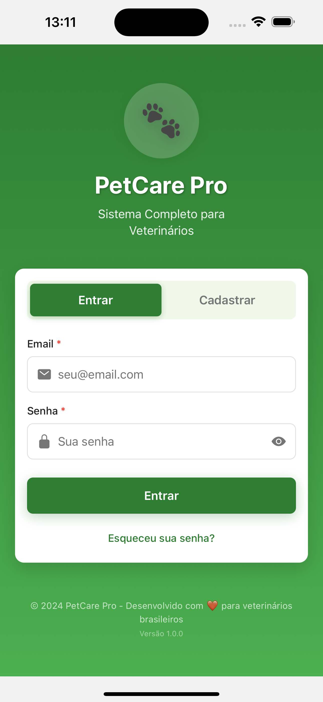
        <br />
        <strong>Login Profissional</strong>
        <br />
        <small>Acesso seguro para veterinários</small>
      </td>
      <td align="center">
        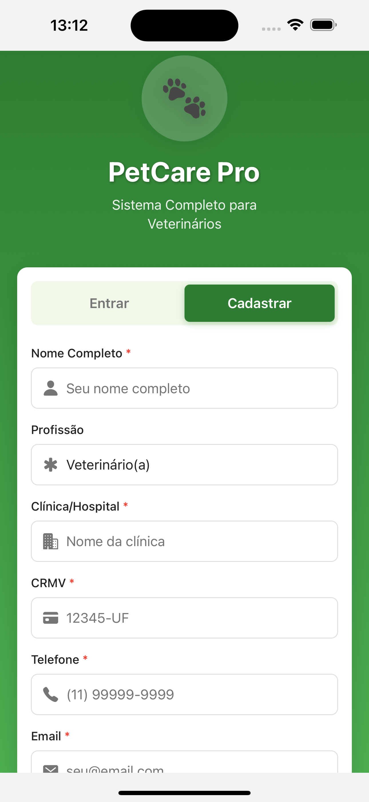
        <br />
        <strong>Cadastro Veterinário</strong>
        <br />
        <small>Registro com CRMV e dados profissionais</small>
      </td>
      <td align="center">
        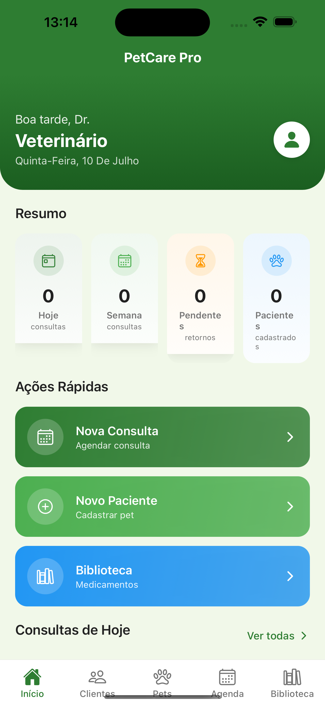
        <br />
        <strong>Dashboard Principal</strong>
        <br />
        <small>Visão geral da clínica</small>
      </td>
    </tr>
  </table>
</div>

### 👥 Gestão de Clientes e Pets

<div align="center">
  <table>
    <tr>
      <td align="center">
        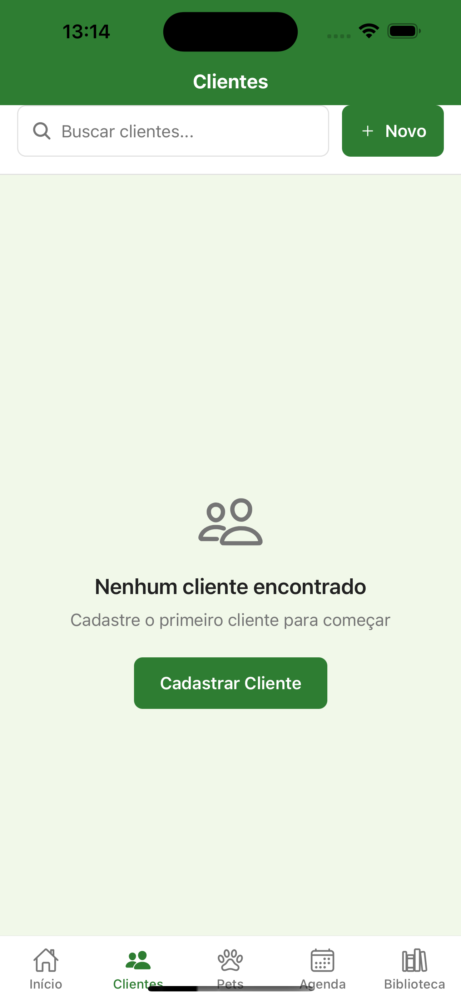
        <br />
        <strong>Gestão de Clientes</strong>
        <br />
        <small>Lista completa de tutores</small>
      </td>
      <td align="center">
        
        <br />
        <strong>Novo Cliente</strong>
        <br />
        <small>Cadastro detalhado de tutores</small>
      </td>
      <td align="center">
        
        <br />
        <strong>Gestão de Pets</strong>
        <br />
        <small>Pacientes da clínica</small>
      </td>
    </tr>
  </table>
</div>

### 🐾 Cadastro e Cuidados com Pets

<div align="center">
  <table>
    <tr>
      <td align="center">
        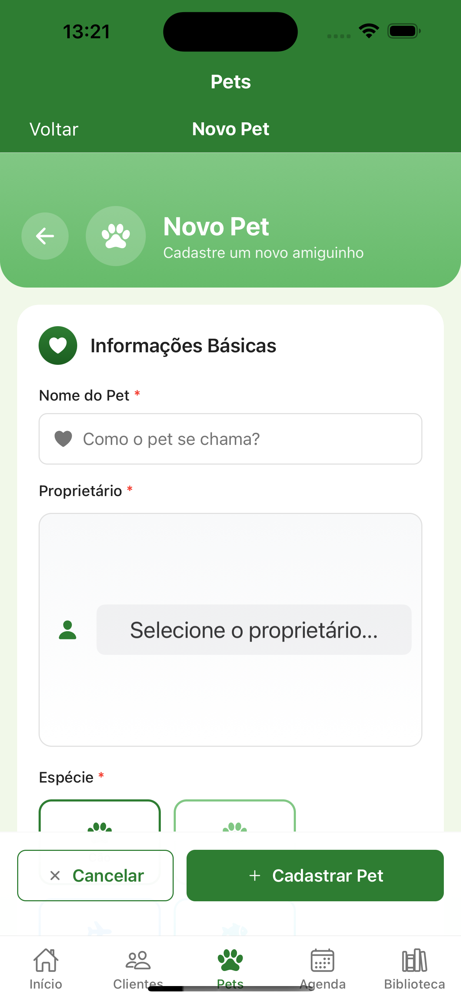
        <br />
        <strong>Cadastro de Pet</strong>
        <br />
        <small>Ficha completa do paciente</small>
      </td>
      <td align="center">
        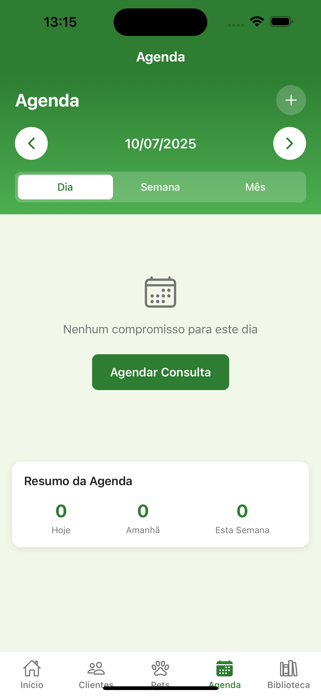
        <br />
        <strong>Agenda Veterinária</strong>
        <br />
        <small>Calendário de atendimentos</small>
      </td>
      <td align="center">
        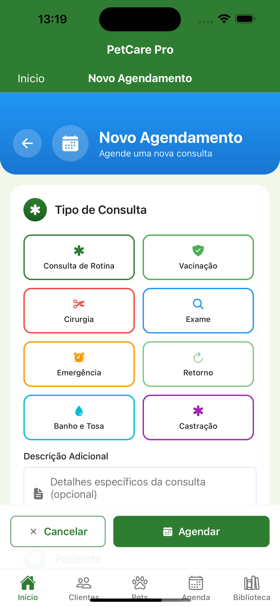
        <br />
        <strong>Agendar Consulta</strong>
        <br />
        <small>Sistema de agendamentos</small>
      </td>
    </tr>
  </table>
</div>

### 📚 Biblioteca Veterinária

<div align="center">
  <table>
    <tr>
      <td align="center">
        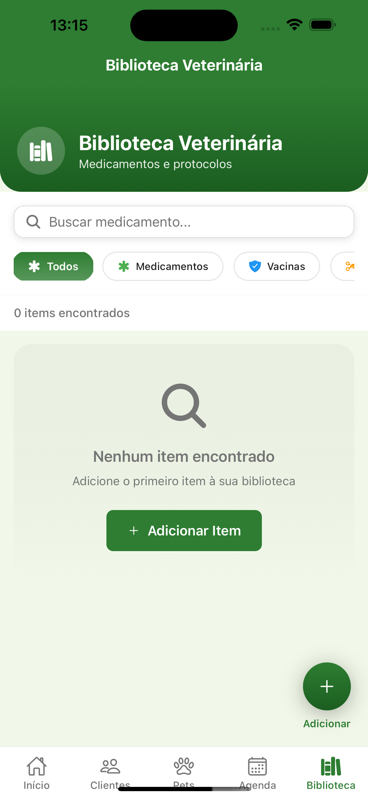
        <br />
        <strong>Biblioteca Veterinária</strong>
        <br />
        <small>Medicamentos, vacinas e procedimentos</small>
      </td>
      <td align="center">
        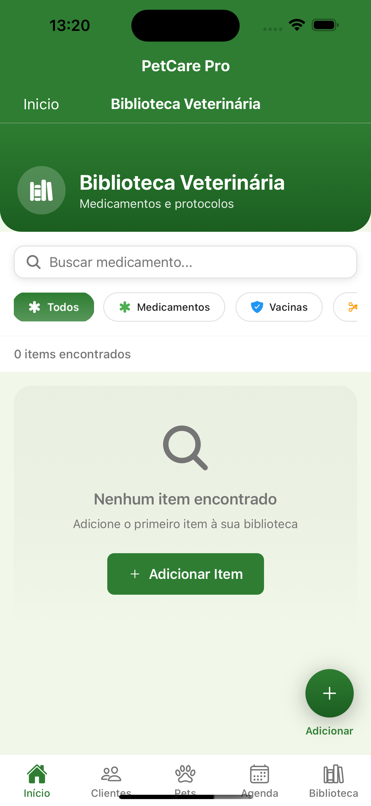
        <br />
        <strong>Novo Item</strong>
        <br />
        <small>Cadastro de medicamentos</small>
      </td>
      <td align="center" style="opacity: 0.7;">
        <div style="width: 200px; height: 356px; background: linear-gradient(135deg, #2E7D32 0%, #4CAF50 100%); border-radius: 10px; display: flex; align-items: center; justify-content: center; color: white; font-weight: bold; text-align: center;">
          <div>
            <div style="font-size: 48px; margin-bottom: 10px;">💊</div>
            <div>Prescrições<br/>Digitais</div>
            <div style="font-size: 12px; margin-top: 5px; opacity: 0.8;">V1.2</div>
          </div>
        </div>
        <br />
        <strong>Sistema de Prescrições</strong>
      </td>
    </tr>
  </table>
</div>

### 👤 Perfil e Configurações

<div align="center">
  <table>
    <tr>
      <td align="center">
        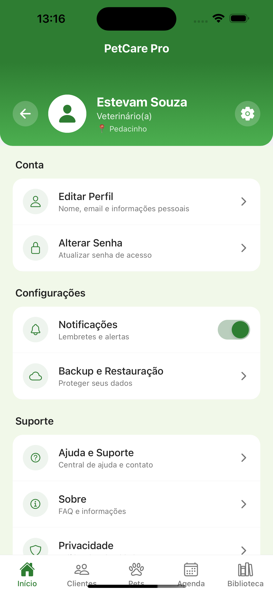
        <br />
        <strong>Perfil Profissional</strong>
        <br />
        <small>Dados do veterinário</small>
      </td>
      <td align="center">
        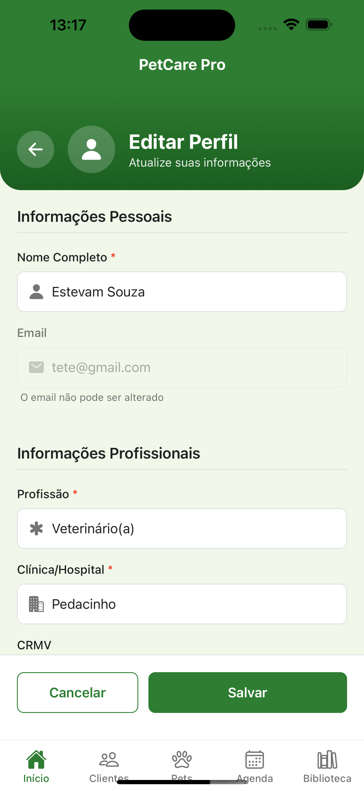
        <br />
        <strong>Editar Perfil</strong>
        <br />
        <small>Atualização de dados</small>
      </td>
      <td align="center">
        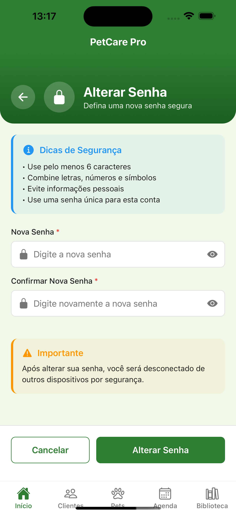
        <br />
        <strong>Segurança</strong>
        <br />
        <small>Alteração de senha</small>
      </td>
    </tr>
  </table>
</div>

### ⚙️ Configurações e Suporte

<div align="center">
  <table>
    <tr>
      <td align="center">
        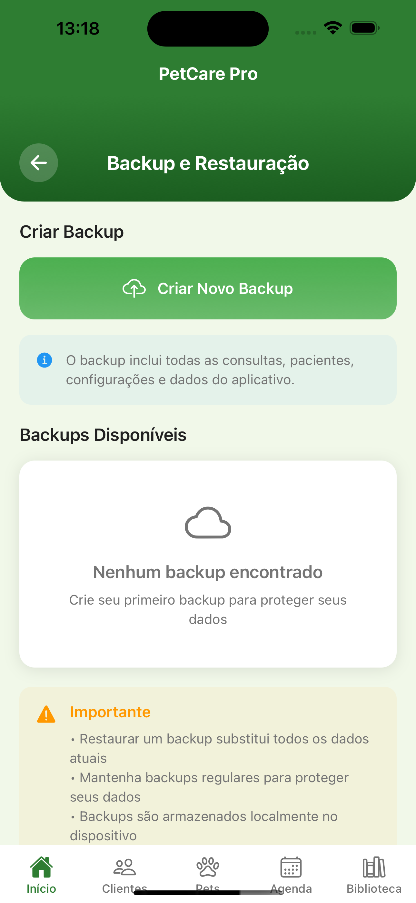
        <br />
        <strong>Backup & Restauração</strong>
        <br />
        <small>Segurança dos dados</small>
      </td>
      <td align="center">
        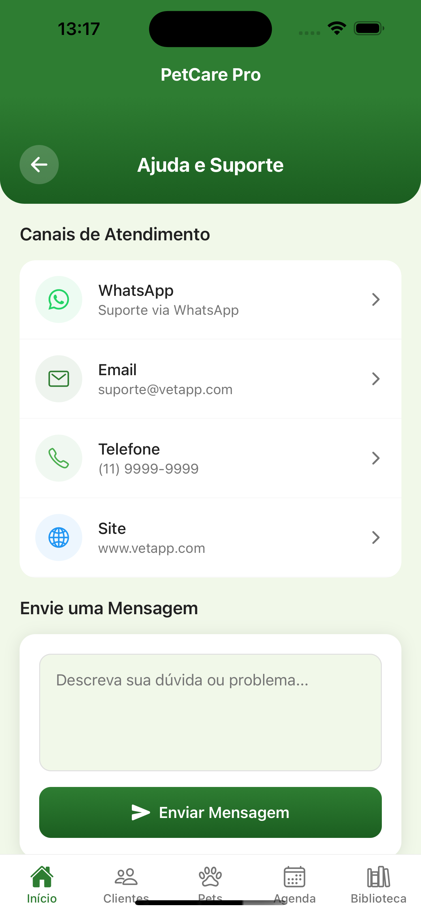
        <br />
        <strong>Ajuda & Suporte</strong>
        <br />
        <small>Central de atendimento</small>
      </td>
      <td align="center">
        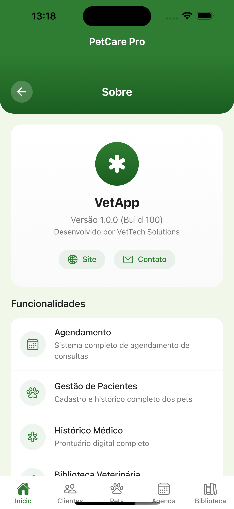
        <br />
        <strong>Sobre o PetCare Pro</strong>
        <br />
        <small>Informações do aplicativo</small>
      </td>
    </tr>
  </table>
</div>

### 📋 Informações e Políticas

<div align="center">
  <table>
    <tr>
      <td align="center">
        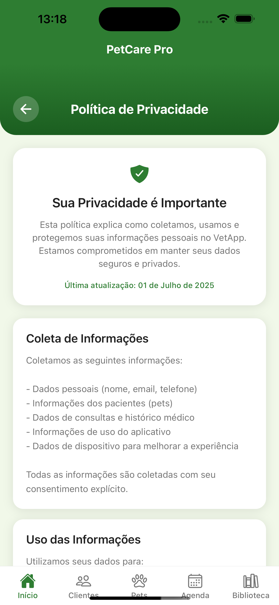
        <br />
        <strong>Políticas de Privacidade</strong>
        <br />
        <small>LGPD e proteção de dados</small>
      </td>
      <td align="center">
        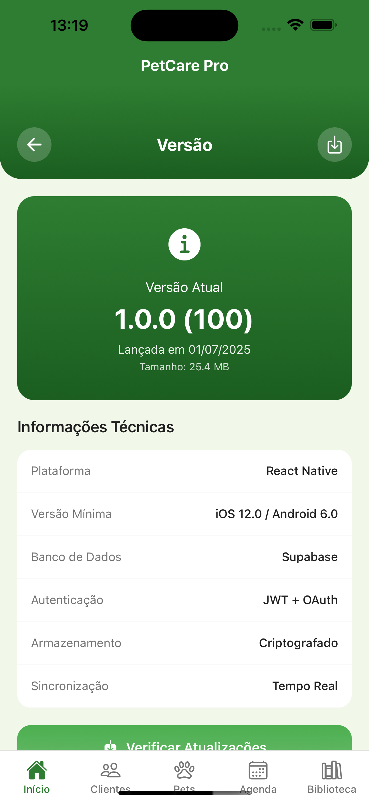
        <br />
        <strong>Informações da Versão</strong>
        <br />
        <small>Atualizações e changelog</small>
      </td>
      <td align="center" style="opacity: 0.7;">
        <div style="width: 200px; height: 356px; background: linear-gradient(135deg, #81C784 0%, #66BB6A 100%); border-radius: 10px; display: flex; align-items: center; justify-content: center; color: white; font-weight: bold; text-align: center;">
          <div>
            <div style="font-size: 48px; margin-bottom: 10px;">📊</div>
            <div>Relatórios<br/>Detalhados</div>
            <div style="font-size: 12px; margin-top: 5px; opacity: 0.8;">Próxima versão</div>
          </div>
        </div>
        <br />
        <strong>Relatórios & Analytics</strong>
      </td>
    </tr>
  </table>
</div>

### 📋 Resumo Funcional por Categoria

| Categoria | Funcionalidades | Telas Disponíveis |
|-----------|-----------------|-------------------|
| 🔐 **Autenticação** | Login seguro, registro profissional, dashboard | 3 |
| 👥 **Gestão de Clientes** | CRUD completo, busca avançada | 2 |
| 🐾 **Gestão de Pets** | Cadastro detalhado, histórico médico | 2 |
| 📅 **Agendamentos** | Sistema de agenda, marcação de consultas | 2 |
| 📚 **Biblioteca** | Medicamentos, vacinas, procedimentos | 2 |
| 👤 **Perfil** | Dados profissionais, segurança | 3 |
| ⚙️ **Configurações** | Backup, suporte, informações | 3 |
| 📋 **Informações** | Políticas, versão do app | 2 |
| **Total Implementado** | | **19 telas** |

---

## 🚀 Características

### ✅ Funcionalidades Implementadas

| Módulo | Funcionalidade | Status |
|--------|----------------|--------|
| 🔐 **Autenticação** | Sistema completo de login/registro | ✅ Completo |
| 📊 **Dashboard** | Estatísticas em tempo real | ✅ Completo |
| 👥 **Gestão de Clientes** | CRUD completo com validações | ✅ Completo |
| 🐾 **Gestão de Pets** | Cadastro detalhado e histórico | ✅ Completo |
| 📋 **Consultas** | Registro completo de atendimentos | ✅ Completo |
| 📅 **Agenda** | Sistema de agendamentos | ✅ Completo |
| 📚 **Biblioteca Veterinária** | Medicamentos, vacinas e procedimentos | ✅ Completo |
| 📱 **Interface Responsiva** | Design moderno e intuitivo | ✅ Completo |
| 💾 **Armazenamento** | Banco de dados robusto (Supabase) | ✅ Completo |
| ✅ **Validação** | Formulários com validação completa | ✅ Completo |
| 🔄 **Estados** | Loading, erro e sucesso | ✅ Completo |

### 🚧 Em Desenvolvimento

| Funcionalidade | Previsão | Prioridade |
|----------------|----------|------------|
| 📧 **Notificações Push** | v1.1.0 | Alta |
| 📊 **Relatórios PDF** | v1.2.0 | Alta |
| ☁️ **Backup em Nuvem** | v1.2.0 | Média |
| 🔄 **Sincronização Multi-device** | v1.3.0 | Média |
| 📱 **App para Clientes** | v2.0.0 | Baixa |
| 🏥 **Multi-clínica** | v2.0.0 | Baixa |

---

## 🛠️ Tecnologias

### 🎯 Core Technologies

| Tecnologia | Versão | Propósito |
|------------|--------|-----------|
| **React Native** | 0.79.2 | Framework principal para desenvolvimento móvel |
| **Expo SDK** | 53.0.9 | Plataforma de desenvolvimento e build |
| **Supabase** | 2.39.0 | Backend-as-a-Service (BaaS) |
| **React Navigation** | v6 | Navegação entre telas |
| **AsyncStorage** | 2.1.2 | Armazenamento local |

### 🎨 UI/UX Libraries

| Biblioteca | Versão | Funcionalidade |
|------------|--------|----------------|
| **Expo Vector Icons** | 14.1.0 | Ícones vetorizados |
| **React Native Gesture Handler** | 2.24.0 | Gestos e interações |
| **React Native Reanimated** | 3.17.4 | Animações fluidas |
| **Expo Linear Gradient** | 14.1.4 | Gradientes visuais |
| **React Native Safe Area Context** | 5.4.0 | Área segura para dispositivos |

### 🔧 Development Tools

| Ferramenta | Versão | Propósito |
|------------|--------|-----------|
| **Babel Core** | 7.20.0 | Transpilação JavaScript |
| **React Native Picker** | 2.11.0 | Seletores dropdown |
| **Expo Image Picker** | 15.0.7 | Seleção de imagens |
| **Expo Splash Screen** | 0.29.9 | Tela de carregamento |

### 🗄️ Database & Backend

| Serviço | Funcionalidade |
|---------|----------------|
| **Supabase PostgreSQL** | Banco de dados principal |
| **Supabase Auth** | Autenticação de usuários |
| **Supabase Storage** | Armazenamento de arquivos |
| **Supabase Realtime** | Sincronização em tempo real |

---

## 📱 Compatibilidade

### 📋 Requisitos de Sistema

| Plataforma | Versão Mínima | Status |
|------------|---------------|--------|
| **iOS** | 12.0+ | ✅ Totalmente suportado |
| **Android** | API 21+ (Android 5.0) | ✅ Totalmente suportado |
| **Expo Go** | Última versão | ✅ Desenvolvimento e testes |
| **Expo Development Build** | - | ✅ Builds customizados |

### 🎯 Dispositivos Testados

- **iOS**: iPhone 12+, iPad Air 4+
- **Android**: Samsung Galaxy S21+, Pixel 6+
- **Tablets**: Suporte responsivo completo

---

## 🏗️ Arquitetura

### 📐 Padrões Arquiteturais

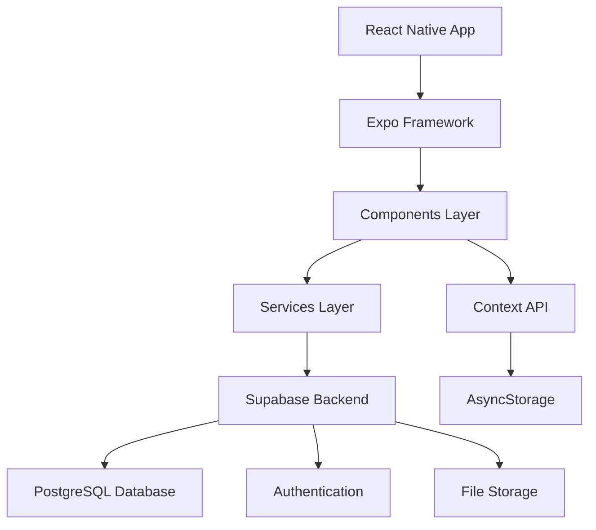

### 🔄 Fluxo de Dados

1. **UI Components** → Interação do usuário
2. **Context API** → Gerenciamento de estado global
3. **Services** → Lógica de negócio e API calls
4. **Supabase** → Backend e persistência
5. **AsyncStorage** → Cache local

---

## 📁 Estrutura do Projeto

```
📦 PetCare Pro
├── 📱 App.js                     # Componente raiz da aplicação
├── 📝 app.json                   # Configurações do Expo
├── 📦 package.json               # Dependências e scripts
├── 🛠️ babel.config.js            # Configuração do Babel
├── 🚫 .gitignore                 # Arquivos ignorados pelo Git
├── 📖 README.md                  # Documentação do projeto
├── 🖼️ assets/                    # Recursos estáticos
│   └── 🎨 logo.png              # Logo da aplicação
├── 🗄️ db/                        # Scripts de banco de dados
│   └── 📊 supabase.sql          # Schema e dados iniciais
└── 📂 src/                       # Código fonte principal
    ├── 🧩 components/            # Componentes reutilizáveis
    │   ├── 🔄 common/           # Componentes genéricos
    │   │   ├── 🔘 Button.js     # Botão customizado
    │   │   ├── 📇 Card.js       # Container de conteúdo
    │   │   ├── 📝 Input.js      # Campo de entrada
    │   │   └── ⏳ Loading.js    # Indicador de carregamento
    │   └── 📋 forms/            # Componentes de formulário
    ├── 📱 screens/              # Telas da aplicação
    │   ├── 🔐 auth/             # Autenticação
    │   │   └── 🚪 LoginScreen.js
    │   ├── 👥 clients/          # Gestão de clientes
    │   │   ├── 📋 ClientListScreen.js
    │   │   └── ➕ NewClientScreen.js
    │   ├── 🐾 pets/             # Gestão de pets
    │   │   ├── 📋 PetListScreen.js
    │   │   └── ➕ NewPetScreen.js
    │   ├── 🩺 consultations/    # Consultas veterinárias
    │   │   └── ➕ NewConsultationScreen.js
    │   ├── 📅 agenda/           # Sistema de agendamentos
    │   │   ├── 📅 AgendaScreen.js
    │   │   └── ➕ NewAppointmentScreen.js
    │   ├── 📚 library/          # Biblioteca veterinária
    │   │   └── 📖 VetLibraryScreen.js
    │   ├── 👤 profile/          # Perfil do usuário
    │   │   └── 👤 ProfileScreen.js
    │   └── 🏠 HomeScreen.js     # Dashboard principal
    ├── 🌐 services/             # Serviços de dados
    │   ├── 👥 ClientService.js
    │   ├── 🐾 PetService.js
    │   ├── 🩺 ConsultationService.js
    │   ├── 📅 AppointmentService.js
    │   └── 📚 LibraryService.js
    ├── 🔄 contexts/             # Contextos React
    │   └── 🔐 AuthContext.js
    ├── 📱 navigation/           # Configuração de navegação
    │   ├── 🧭 AppNavigator.js
    │   ├── 🔐 AuthNavigator.js
    │   └── 🏠 MainNavigator.js
    ├── 🎨 constants/            # Constantes da aplicação
    │   ├── 🎨 Colors.js
    │   ├── 📊 Data.js
    │   └── 💾 Storage.js
    ├── 🔧 utils/                # Utilitários
    │   ├── 🛠️ helpers.js
    │   ├── 💾 storage.js
    │   └── ✅ validators.js
    ├── 🎨 styles/               # Estilos globais
    │   └── 🌐 globalStyles.js
    └── ⚙️ config/               # Configurações
        └── 🔧 supabase.js
```

---

## ⚡ Instalação e Configuração

### 📋 Pré-requisitos

Certifique-se de ter instalado:

- **Node.js** (versão 18.0.0 ou superior)
- **npm** ou **yarn**
- **Expo CLI** (recomendado: versão mais recente)
- **Git**

```bash
# Verificar versões
node --version    # v18.0.0+
npm --version     # 8.0.0+
expo --version    # 49.0.0+
```

### 🚀 Instalação Rápida

#### Opção 1: Clone do Repositório

```bash
# 1. Clone o repositório
git clone https://github.com/PetCareAi/consultorio-app.git

# 2. Entre no diretório
cd consultorio-app

# 3. Instale as dependências
npm install
# ou
yarn install

# 4. Configure o banco de dados (ver seção Database)

# 5. Inicie o projeto
npm start
# ou
expo start
```

### ⚙️ Configuração do Supabase

1. **Criar conta no Supabase**: [https://supabase.com](https://supabase.com)

2. **Criar novo projeto**:
   - Nome: `PetCare Pro`
   - Região: `South America (São Paulo)`
   - Senha do banco: (escolha uma senha forte)

3. **Executar script do banco**:
   ```sql
   -- Execute o conteúdo do arquivo db/supabase.sql
   -- no SQL Editor do Supabase
   ```

4. **Configurar credenciais**:
   ```javascript
   // src/config/supabase.js
   const supabaseUrl = 'SUA_URL_DO_SUPABASE'
   const supabaseAnonKey = 'SUA_CHAVE_PUBLICA'
   ```

---

## 🎮 Como Usar

### 🔐 Primeiro Acesso

1. **Abra o aplicativo**
2. **Use as credenciais de demonstração**:
   - 📧 **Email**: `admin@petcare.com`
   - 🔒 **Senha**: `123456`
3. **Ou crie uma nova conta** clicando em "Cadastrar"

### 🏠 Dashboard Principal

O dashboard oferece uma visão geral completa:

- **📊 Estatísticas em tempo real**
- **📅 Agenda do dia**
- **⚡ Ações rápidas**
- **📈 Métricas importantes**

### 👥 Gestão de Clientes

#### ➕ Adicionar Cliente
1. Navegue para **Clientes** → **Novo**
2. Preencha os dados obrigatórios:
   - Nome completo
   - Email
   - Telefone
3. Dados opcionais:
   - CPF, endereço, observações

#### 🔍 Buscar Clientes
- Use a barra de busca
- Pesquise por: nome, email, telefone, CPF

### 🐾 Gestão de Pets

#### ➕ Cadastrar Pet
1. **Clientes** → Selecionar cliente → **Novo Pet**
2. Informações básicas:
   - Nome do pet
   - Espécie (Cão, Gato, etc.)
   - Raça
   - Sexo
3. Detalhes físicos:
   - Data de nascimento
   - Peso
   - Cor
   - Microchip

---

## 📊 Funcionalidades Principais

### 🔐 Sistema de Autenticação

```javascript
// Exemplo de uso
const { login, register, logout, user } = useAuth();

// Login
const result = await login('email@exemplo.com', 'senha123');

// Verificar se está autenticado
if (user) {
  // Usuário logado
}
```

### 📊 Dashboard Interativo

- **Estatísticas em tempo real**
- **Gráficos e métricas**
- **Agenda do dia**
- **Ações rápidas**
- **Lembretes importantes**

### 👥 Gestão Completa de Clientes

```javascript
// Exemplo de operações CRUD
import { ClientService } from '../services/ClientService';

// Listar clientes
const clients = await ClientService.getAll();

// Criar cliente
const result = await ClientService.create(clientData);

// Buscar cliente
const clients = await ClientService.search('João');
```

---

## 🎨 Design System

### 🎨 Paleta de Cores

```javascript
// Cores principais
const Colors = {
  primary: '#2E7D32',        // Verde veterinário principal
  primaryDark: '#1B5E20',    // Verde escuro
  primaryLight: '#4CAF50',   // Verde claro
  secondary: '#81C784',      // Verde secundário
  accent: '#66BB6A',         // Verde destaque
  
  // Cores de superfície
  background: '#F1F8E9',     // Fundo principal
  surface: '#FFFFFF',        // Superfícies de cartões
  
  // Cores de status
  error: '#F44336',          // Erro/perigo
  warning: '#FF9800',        // Aviso
  info: '#2196F3',          // Informação
  success: '#4CAF50',       // Sucesso
  
  // Cores de texto
  text: '#212121',          // Texto principal
  textSecondary: '#757575', // Texto secundário
  border: '#E0E0E0',        // Bordas
};
```

### 🧩 Componentes

#### Button Component
```javascript
<Button 
  title="Salvar"
  variant="primary"        // primary, secondary, outline, danger
  size="medium"           // small, medium, large
  loading={false}
  onPress={handleSave}
  icon={<Ionicons name="save" />}
/>
```

#### Input Component
```javascript
<Input 
  label="Nome"
  placeholder="Digite o nome"
  leftIcon="person"
  error="Campo obrigatório"
  required
  multiline={false}
/>
```

---

## 📘 Scripts Disponíveis

### 🚀 Scripts de Desenvolvimento

```bash
# Iniciar servidor de desenvolvimento
npm start

# Executar no iOS Simulator
npm run ios

# Executar no Android Emulator
npm run android

# Executar na web
npm run web

# Setup inicial do projeto
npm run setup

# Resetar cache e dependências
npm run reset

# Gerar build para produção
npm run prebuild
```

---

## 🔧 Configuração do Ambiente

### ☁️ Configuração do Supabase

#### 1. Configuração Inicial

```javascript
// src/config/supabase.js
import { createClient } from '@supabase/supabase-js';

const supabaseUrl = 'https://seu-projeto.supabase.co';
const supabaseAnonKey = 'sua-chave-publica';

export const supabase = createClient(supabaseUrl, supabaseAnonKey, {
  auth: {
    autoRefreshToken: true,
    persistSession: true,
    detectSessionInUrl: false,
  },
});
```

#### 2. Configuração de Políticas RLS

```sql
-- Habilitar RLS (Row Level Security)
ALTER TABLE users_consultorio ENABLE ROW LEVEL SECURITY;
ALTER TABLE clients_consultorio ENABLE ROW LEVEL SECURITY;
ALTER TABLE pets_consultorio ENABLE ROW LEVEL SECURITY;
ALTER TABLE consultations_consultorio ENABLE ROW LEVEL SECURITY;
ALTER TABLE appointments_consultorio ENABLE ROW LEVEL SECURITY;

-- Políticas de exemplo
CREATE POLICY "Users can view own data" ON clients_consultorio
  FOR SELECT USING (user_id = auth.uid());
```

---

## 🗄️ Banco de Dados

### 📊 Schema Principal

```sql
-- Usuários (Veterinários)
CREATE TABLE users_consultorio (
  id UUID PRIMARY KEY,
  email VARCHAR(255) UNIQUE NOT NULL,
  name VARCHAR(255) NOT NULL,
  profession VARCHAR(100) DEFAULT 'Veterinário(a)',
  clinic VARCHAR(255),
  crmv VARCHAR(50),
  phone VARCHAR(20),
  photo_url TEXT,
  created_at TIMESTAMP WITH TIME ZONE DEFAULT NOW(),
  updated_at TIMESTAMP WITH TIME ZONE DEFAULT NOW()
);

-- Clientes
CREATE TABLE clients_consultorio (
  id UUID DEFAULT gen_random_uuid() PRIMARY KEY,
  user_id UUID NOT NULL REFERENCES users_consultorio(id),
  name VARCHAR(255) NOT NULL,
  email VARCHAR(255) NOT NULL,
  phone VARCHAR(20) NOT NULL,
  cpf VARCHAR(14),
  address TEXT,
  city VARCHAR(100),
  state VARCHAR(2),
  zip_code VARCHAR(10),
  notes TEXT,
  created_at TIMESTAMP WITH TIME ZONE DEFAULT NOW(),
  updated_at TIMESTAMP WITH TIME ZONE DEFAULT NOW()
);

-- Pets
CREATE TABLE pets_consultorio (
  id UUID DEFAULT gen_random_uuid() PRIMARY KEY,
  client_id UUID NOT NULL REFERENCES clients_consultorio(id),
  name VARCHAR(255) NOT NULL,
  species VARCHAR(50) NOT NULL,
  breed VARCHAR(100),
  gender VARCHAR(10) NOT NULL,
  birth_date DATE,
  weight DECIMAL(5,2),
  color VARCHAR(100),
  microchip VARCHAR(50),
  photo_url TEXT,
  notes TEXT,
  created_at TIMESTAMP WITH TIME ZONE DEFAULT NOW(),
  updated_at TIMESTAMP WITH TIME ZONE DEFAULT NOW()
);

-- Consultas
CREATE TABLE consultations_consultorio (
  id UUID DEFAULT gen_random_uuid() PRIMARY KEY,
  client_id UUID NOT NULL REFERENCES clients_consultorio(id),
  pet_id UUID NOT NULL REFERENCES pets_consultorio(id),
  user_id UUID NOT NULL REFERENCES users_consultorio(id),
  type VARCHAR(100) NOT NULL,
  date TIMESTAMP WITH TIME ZONE NOT NULL,
  symptoms TEXT,
  diagnosis TEXT,
  treatment TEXT,
  prescription TEXT,
  observations TEXT,
  follow_up_date TIMESTAMP WITH TIME ZONE,
  weight DECIMAL(5,2),
  temperature DECIMAL(4,1),
  heart_rate INTEGER,
  price DECIMAL(10,2) DEFAULT 0,
  created_at TIMESTAMP WITH TIME ZONE DEFAULT NOW(),
  updated_at TIMESTAMP WITH TIME ZONE DEFAULT NOW()
);
```

---

## 🔗 Links Importantes

### 📚 Recursos Oficiais
- 🌐 **Site Oficial:** https://language.petcareai.com.br/
- 📖 **Documentação:** https://language.petcareai.com.br/docs
- 🎓 **Tutoriais:** https://language.petcareai.com.br/tutorials
- 📦 **NPM Package:** https://www.npmjs.com/package/petcarescript
- 🧩 **VS Code Extension:** https://marketplace.visualstudio.com/items?itemName=petcarescript.petcarescript

### 🛠️ Desenvolvimento
- 💻 **GitHub Repository:** https://github.com/PetCareAi/petcarescript
- 🐛 **Issues & Bugs:** https://github.com/PetCareAi/petcarescript/issues
- 💬 **Discussions:** https://github.com/PetCareAi/petcarescript/discussions
- 🔄 **Pull Requests:** https://github.com/PetCareAi/petcarescript/pulls
- 📊 **Project Board:** https://github.com/PetCareAi/petcarescript/projects

### 🌐 PetCareAI Ecosystem

| Recurso | Link | Descrição |
|---------|------|-----------|
| 🌍 **Site Oficial** | [petcareai.com.br](https://petcareai.com.br) | Portal principal |
| 🏢 **GitHub Org** | [github.com/PetCareAI](https://github.com/PetCareAi) | 25+ repositórios |
| 💬 **Discord** | [discord.gg/petcareai](https://discord.gg/petcareai) | Comunidade ativa |
| 📚 **Documentação** | [docs.petcareai.com.br](https://documentation.petcareai.com.br) | Wiki completa |
| 📋 **Tasks** | [tasks.petcareai.com.br](https://tasks.petcareai.com.br) | Gerenciamento ágil |
| 📊 **Analytics** | [analytics.petcareai.com.br](https://analytics.petcareai.com.br) | Dashboards |

---

## 📈 Roadmap

### 🎯 Versão 1.1.0 (Q2 2025)
- [ ] 📧 **Sistema de notificações push**
- [ ] 🔄 **Sincronização offline**
- [ ] 📊 **Relatórios básicos em PDF**
- [ ] 🔐 **Recuperação de senha**
- [ ] 👤 **Perfil detalhado do veterinário**

### 🎯 Versão 1.2.0 (Q3 2025)
- [ ] 📅 **Agendamento online para clientes**
- [ ] 🤖 **Lembretes automáticos (WhatsApp/SMS)**
- [ ] 📱 **App dedicado para clientes**
- [ ] 💳 **Integração com meios de pagamento**
- [ ] 📋 **Templates de prescrição**

### 🧠 Categoria IA & Machine Learning
- **Ultra ML Pet Detection v6.0** - Sistema ultra-profissional com YOLO e MediaPipe
- **PetCareAI Analytics** - Análise avançada com Machine Learning
- **LLM AI Assistant** - Assistentes virtuais com Gemini AI
- **Sistemas de Computer Vision** para análise veterinária

### 🔮 Futuro
- [ ] 🏆 **Sistema de gamificação**
- [ ] 📺 **Telemedicina veterinária**
- [ ] 🔗 **Blockchain para registros médicos**
- [ ] 🎯 **Machine Learning para previsões**

---

## 🤝 Contribuição

Contribuições são sempre bem-vindas! Este projeto é open source e desenvolvido para a comunidade veterinária brasileira.

### 🚀 Como Contribuir

#### 1. 🍴 Fork do Projeto
```bash
# Fork no GitHub e clone
git clone https://github.com/seu-usuario/petcare-pro.git
cd petcare-pro
```

#### 2. 🌿 Criar Branch
```bash
# Criar branch para feature
git checkout -b feature/nova-funcionalidade

# Criar branch para bugfix
git checkout -b bugfix/correcao-bug
```

#### 3. 💻 Desenvolvimento
```bash
# Instalar dependências
npm install

# Executar em modo desenvolvimento
npm start

# Executar testes
npm test
```

### 📝 Padrões de Commit

Seguimos o padrão [Conventional Commits](https://www.conventionalcommits.org/):

```bash
# Tipos de commit
feat:     # Nova funcionalidade
fix:      # Correção de bug
docs:     # Documentação
style:    # Formatação, sem mudança de código
refactor: # Refatoração de código
test:     # Adição ou correção de testes
chore:    # Manutenção geral
```

---

## 👥 Equipe de Desenvolvimento

### **Core Team**
- **Tech Lead** - Arquitetura e desenvolvimento principal
- **Mobile Developer** - Desenvolvimento React Native
- **Backend Developer** - APIs e banco de dados
- **UX/UI Designer** - Interface e experiência

### 🚀 Líder Técnico

<div align="center">
  
  <br />
  <strong>Estevam Souza</strong><br />
  <em>Especialista TI Full-Stack</em><br />
  <a href="https://linkedin.com/in/estevam-souza">LinkedIn</a> |
  <a href="https://github.com/estevam5s">GitHub</a> |
  <a href="https://estevamsouza.com.br">Website</a>
</div>

### 🚀 Core Team

<table>
  <tr>
    <td align="center">
      
      <br />
      <sub><b>João Silva</b></sub>
      <br />
      <sub>Tech Lead & Full Stack Developer</sub>
      <br />
      <a href="mailto:joao@petcarepro.com">📧</a>
      <a href="https://linkedin.com/in/joao">💼</a>
    </td>
    <td align="center">
      
      <br />
      <sub><b>Maria Santos</b></sub>
      <br />
      <sub>UI/UX Designer & Frontend Developer</sub>
      <br />
      <a href="mailto:maria@petcarepro.com">📧</a>
      <a href="https://linkedin.com/in/maria">💼</a>
    </td>
    <td align="center">
      
      <br />
      <sub><b>Dr. Carlos Mendes</b></sub>
      <br />
      <sub>Veterinary Advisor & Product Owner</sub>
      <br />
      <a href="mailto:carlos@petcarepro.com">📧</a>
      <a href="https://linkedin.com/in/carlos">💼</a>
    </td>
  </tr>
</table>

### 🌟 Contributors

Agradecemos a todos os [contribuidores](CONTRIBUTORS.md) que ajudaram a construir este projeto.

<a href="https://github.com/petcare-pro/petcare-pro/graphs/contributors">
  
</a>

### 🤝 Como Juntar-se à Equipe

**Estamos sempre buscando novos talentos!**

- 📞 **Discord**: [discord.gg/petcareai](https://discord.gg/petcareai)
- 💼 **LinkedIn**: [company/petcare-ai](https://linkedin.com/company/petcare-ai)
- 📧 **Email**: contato@petcareai.com.br

**Áreas Abertas:**
- 👨‍💻 Desenvolvedores (Frontend, Backend, Mobile)
- 🧠 Especialistas IA/ML
- 🛡️ Cybersecurity Engineers
- 📊 Data Scientists
- 🎨 UI/UX Designers
- 📈 Marketing Digital

---

## 📜 Licença

Este projeto está sob [licença proprietária](LICENSE) da **PetCareAi Ltda**.

Para licenciamento e autorizações: **legal@petcareai.com.br**

### 📋 Resumo da Licença MIT

✅ **Permitido:**
- ✅ Uso comercial
- ✅ Modificação
- ✅ Distribuição
- ✅ Uso privado

❌ **Limitações:**
- ❌ Responsabilidade
- ❌ Garantia

📝 **Condições:**
- 📝 Incluir licença e copyright

---

## 🙏 Agradecimentos

### 🙏 **Reconhecimentos Especiais**

- **Google** pelo Gemini 2.0 Flash API
- **Microsoft** pelo VS Code e sua excelente API de extensões
- **Comunidade Open Source** por inspiração e feedback contínuo
- **Beta Testers** por ajudar a melhorar a extensão
- **Contribuidores** que tornaram este projeto possível

### 🌟 **Inspirações**
- **GitHub Copilot** - Inspiração para IA integrada
- **Material Icon Theme** - Padrões de iconografia
- **Dracula Theme** - Inspiração para temas escuros
- **Vue.js Community** - Melhores práticas de desenvolvimento

### **Tecnologias e Ferramentas**

- 🧠 **Google AI** - Pela API Gemini revolucionária
- 🔬 **TensorFlow Team** - Pela plataforma de ML mais avançada
- ⚛️ **React Community** - Pelo ecossistema incrível
- 📦 **Open Source Community** - Por todas as bibliotecas utilizadas

### **Validação Científica**

- 🏥 **Hospital Veterinário USP** - Validação dos algoritmos
- 🎓 **FMVZ-USP** - Consultoria científica
- 👨‍⚕️ **CFMV** - Orientações éticas e técnicas
- 🐕 **ANCLIVEPA** - Apoio da comunidade veterinária

### **Beta Testers**

Agradecimento especial aos **500+ tutores** que participaram dos testes beta e ajudaram a aperfeiçoar nossa IA.

### 🏆 Reconhecimentos Especiais

- **🩺 Conselho Regional de Medicina Veterinária de São Paulo (CRMV-SP)** - Consultoria técnica
- **🏥 Clínica Veterinária VetCare** - Testes e feedback funcional
- **👨‍💻 React Native Community** - Suporte técnico e bibliotecas
- **☁️ Supabase Team** - Plataforma backend robusta
- **🎨 Expo Team** - Framework de desenvolvimento excepcional

### Projetos que Inspiraram

- [React](https://reactjs.org/) - Biblioteca para interfaces
- [Electron](https://electronjs.org/) - Framework para apps desktop
- [Supabase](https://supabase.com/) - Backend open source
- [Chart.js](https://chartjs.org/) - Visualização de dados

### 💝 **Apoie o Projeto**

Gostou da extensão? Considere apoiar o desenvolvimento:

- ⭐ **Star** no [GitHub](https://github.com/PetCareAi/extension-for-devs)
- 🐦 **Compartilhe** nas redes sociais
- 💰 **Doe** via [Buy me a coffee](https://buymeacoffee.com/petcareai)
- 🤝 **Contribua** com código ou documentação

---

## 💬 Suporte

### 🆘 Obter Ajuda

- **📖 Documentação**: [petcarescript.org/docs](https://petcarescript.org/docs)
- **💬 Comunidade Discord**: [discord.gg/petcarescript](https://discord.gg/petcarescript)
- **❓ Stack Overflow**: Marque suas perguntas com `petcarescript`
- **🐛 GitHub Issues**: [Relatar bugs e solicitações de recursos](https://github.com/petcarescript/vscode-extension/issues)

### 📞 Contato

- **📧 Email**: support@petcarescript.org
- **🐦 Twitter**: [@PetCareScript](https://twitter.com/PetCareScript)
- **💼 LinkedIn**: [PetCareScript Official](https://linkedin.com/company/petcarescript)

### 🏢 Suporte Empresarial

Para clientes empresariais, oferecemos:
- **⚡ Suporte Prioritário** - Assistência técnica 24/7
- **🔧 Recursos Personalizados** - Ferramentas de desenvolvimento sob medida
- **📚 Programas de Treinamento** - Onboarding de equipe e workshops
- **🛡️ Auditorias de Segurança** - Análise de segurança de código

Entre em contato: enterprise@petcarescript.org

### 🆘 Canais de Suporte

| Tipo de Suporte | Canal | Resposta |
|------------------|-------|----------|
| **🐛 Bugs & Issues** | [GitHub Issues](https://github.com/PetCareAi/extension-for-devs/issues) | 24-48h |
| **💬 Discussões** | [GitHub Discussions](https://github.com/PetCareAi/extension-for-devs/discussions) | 24h |
| **📧 Suporte Direto** | [support@petcareai.com.br](mailto:support@petcareai.com.br) | 24h |
| **📖 Documentação** | [documentation.petcareai.com.br](https://documentation.petcareai.com.br) | Sempre |

### 💬 Canais de Comunicação

| Canal | Propósito | Tempo de Resposta |
|-------|-----------|-------------------|
| 📧 **Email** | Suporte geral e comercial | 24-48 horas |
| 💬 **WhatsApp** | Suporte técnico urgente | 2-8 horas |
| 🐛 **GitHub Issues** | Bugs e solicitações de funcionalidades | 1-3 dias |
| 📱 **Telegram** | Comunidade de usuários | Tempo real |
| 📺 **YouTube** | Tutoriais e novidades | Semanal |

### 📧 Contatos Diretos

- **🎯 Suporte Geral**: [suporte@petcareai.com.br](mailto:suporte@petcareai.com.br)
- **🔧 Suporte Técnico**: [tech@petcareai.com.br](mailto:tech@petcareai.com.br)
- **💼 Parcerias**: [parcerias@petcareai.com.br](mailto:parcerias@petcareai.com.br)
- **📰 Imprensa**: [imprensa@petcareai.com.br](mailto:imprensa@petcareai.com.br)

### 🆘 Suporte Urgente

Para situações críticas que impedem o funcionamento da clínica:

📞 **Telefone de Emergência**: (11) 9999-8888
💬 **WhatsApp**: [wa.me/5511999998888](https://wa.me/5511999998888)

### 🚀 Treinamentos e Workshops

Oferecemos treinamentos gratuitos para maximizar o uso do sistema:

#### 📅 Agenda de Treinamentos
- **🟢 Básico**: Segundas-feiras às 19h (1h)
- **🟡 Intermediário**: Quartas-feiras às 19h (1.5h)
- **🔴 Avançado**: Sextas-feiras às 19h (2h)

#### 📋 Tópicos Abordados
- ✅ Primeiros passos no PetCare Pro
- ✅ Gestão eficiente de clientes e pets
- ✅ Registro de consultas e prescrições
- ✅ Sistema de agendamentos
- ✅ Relatórios e análises
- ✅ Backup e segurança de dados
- ✅ Dicas e truques avançados

#### 📝 Inscrições
**Link**: [treinamentos.petcareai.com.br](https://treinamentos.petcareai.com.br)
**WhatsApp**: (11) 9999-7777

### 📚 Recursos de Ajuda

#### 📖 Documentação
- **📗 Manual do Usuário**: [docs.petcareai.com.br/manual](https://docs.petcareai.com.br/manual)
- **🔧 Guia Técnico**: [docs.petcareai.com.br/tech](https://docs.petcareai.com.br/tech)
- **❓ FAQ**: [docs.petcareai.com.br/faq](https://docs.petcareai.com.br/faq)

#### 👥 Comunidade
- **💬 Grupo Telegram**: [t.me/petcareai.com.br](https://t.me/petcareai.com.br)
- **📱 Grupo WhatsApp**: [Comunidade PetCare Pro](https://chat.whatsapp.com/petcareai.com.br)
- **💼 LinkedIn Groups**: [Veterinários PetCare Pro](https://linkedin.com/groups/petcareai.com.br)

---

## ⚠️ **Disclaimer Importante**

> **AVISO MÉDICO**: O PetCare AI é uma ferramenta de **triagem e educação** que utiliza inteligência artificial para análise preliminar. 
> 
> **NÃO SUBSTITUI** a consulta veterinária profissional. Sempre procure um médico veterinário licenciado para diagnóstico definitivo e tratamento.
> 
> Em caso de **emergência**, procure imediatamente um veterinário ou hospital veterinário 24h.

---

<div align="center">

## 🎉 **Comece Agora!**

```bash
# Instale PetCareScript em 10 segundos
npm install -g petcarescript

# Execute seu primeiro programa
echo 'show "🐾 Olá, PetCareScript!";' > hello.pcs
pcs hello.pcs
```

### 🌟 **Junte-se à Revolução da Programação Humana!**

[](https://language.petcareai.com.br/getting-started)
[](https://discord.gg/petcarescript)
[](https://twitter.com/petcarescript)

</div>

---

<div align="center">

### **Built with ❤️ for the Developer Community**

**PetCareScript** - *Making programming human-readable, one keyword at a time.*

**© 2025 PetCareScript. Made with 🐾 in Brazil.**

</div>

---

## 📱 Redes Sociais

<div align="center">

[](https://petcarescript.org)
[](https://github.com/estevamsl/petcarescript-website)
[](https://twitter.com/petcareai)
[](https://instagram.com/petcareai)
[](https://linkedin.com/company/petcareai)
[](https://youtube.com/petcareai)

**Instagram**: [@petcarepro.br](https://instagram.com/petcareai.com.br)
**LinkedIn**: [PetCare Pro](https://linkedin.com/company/petcareai.com.br)
**Facebook**: [PetCare Pro Brasil](https://facebook.com/petcareai.com.br)
**Twitter**: [@petcarepro_br](https://twitter.com/petcareai.com.br)

</div>

---

<div align="center">
  <h2>🚀 Pronto para Revolucionar o Cuidado Animal?</h2>
  <p><strong>Junte-se à maior organização de tecnologia pet do Brasil!</strong></p>
  
  <a href="https://discord.gg/petcareai" target="_blank">
    
  </a>
  <a href="https://github.com/PetCareAI" target="_blank">
    
  </a>
  <a href="https://linkedin.com/company/petcare-ai" target="_blank">
    
  </a>
  
  <br /><br />
  
  <p>
    <em>"Transformando o cuidado animal através da tecnologia" 🐾</em><br />
    <strong>© 2025 PetCareAI Organization - Todos os direitos reservados</strong>
  </p>
</div>

---

## Star History

<a href="https://www.star-history.com/#PetCareAi/analytics&Date">
 <picture>
   <source media="(prefers-color-scheme: dark)" srcset="https://api.star-history.com/svg?repos=PetCareAi/analytics&type=Date&theme=dark" />
   <source media="(prefers-color-scheme: light)" srcset="https://api.star-history.com/svg?repos=PetCareAi/analytics&type=Date" />
   
 </picture>
</a>

---

<div align="center">

### 🙏 Obrigado por escolher o PetCare Pro!

**Juntos, estamos revolucionando a medicina veterinária no Brasil**

Desenvolvido com ❤️ por veterinários, para veterinários

---

<p>
  
  
  
</p>

**🐾 Feito com ❤️ para o bem-estar dos pets brasileiros**

⭐ **Se este projeto ajudou você e seu pet, deixe uma estrela!** ⭐

**🐾 PetCare AI Extension v1.0.1 Enhanced**

*Desenvolvido com ❤️ para a comunidade de desenvolvedores*

**Powered by Google Gemini 2.0 Flash | Built with 🤖 AI + 💻 Human Creativity**

*© 2024 PetCare AI. Todos os direitos reservados.*

<p><small>© 2025 PetCareAi. Todos os direitos reservados.</small></p>

</div>
